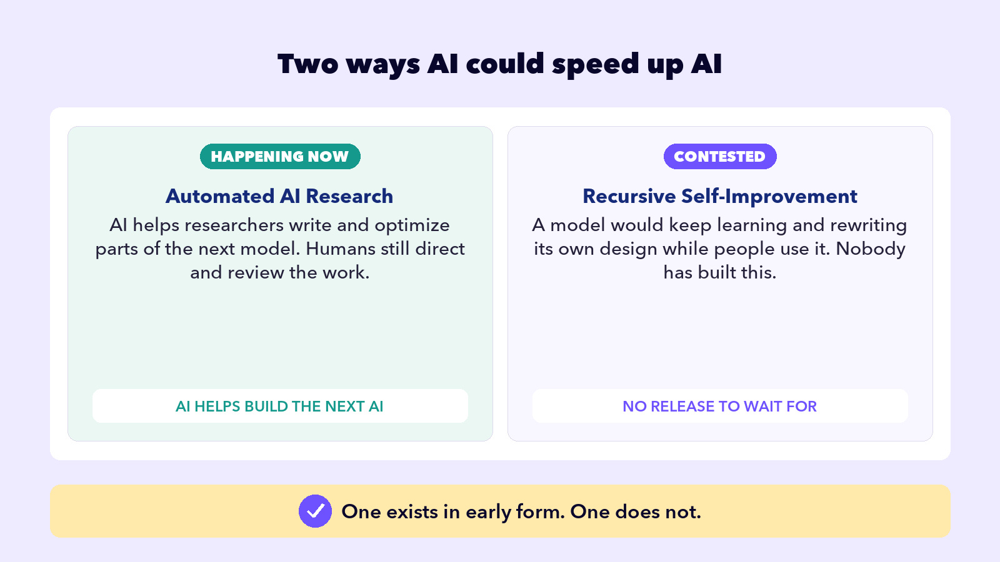
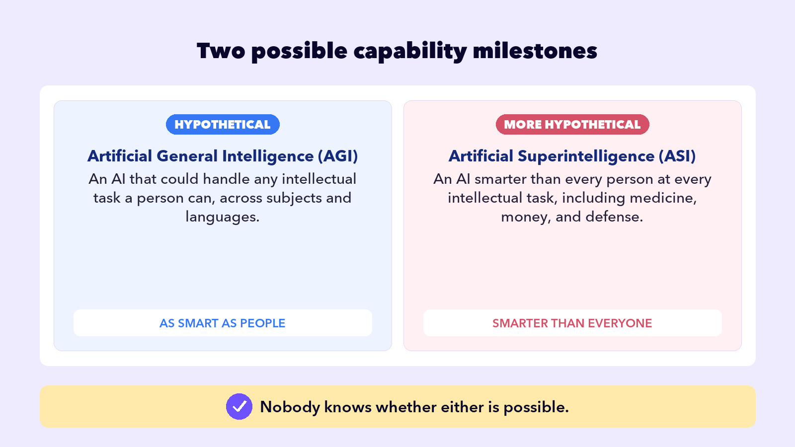

## EMBRACE THE FUTURE

# Pace of Change

The AI argument is getting louder and louder. Why? Because the technology is advancing at blazing speeds.

ChatGPT three years ago vs today

## 3 years ago

## Today

Answering

It started typing the instant you hit enter, with whatever came out first.

It can work on a hard problem quietly before it says a word, sometimes for minutes.

Images

Ask for a picture of your new dog Spot and he might come back with a bonus leg and the ears of a rabbit.

Photoreal images with signs you can actually read, and full video with sound and dialogue.

Memory

The free chatbots most people used could only hold a few pages at once. Push a long chat far enough and the beginning fell out of its head.

The latest models hold a million tokens, which is a whole novel series in view at the same time.

Doing

It told you the steps to do a thing, and wished you luck.

It does the thing. It books, builds, files, and fixes while you watch.

The AI companies are in a race to dominate the industry, so they release new models every couple of months. Each new ChatGPT, Claude, or Gemini release is a new, stronger LLM replacing the one before it. Whatever AI can’t do today, there’s a solid chance it can do it next year.

## Why so fast?

Three concepts are driving the acceleration, and you already understand the first one.

## Accelerant 1

Training

## What’s happening

AI is trained on more data, and often better data. That gives it more examples and patterns to learn from, but quality matters as much as quantity. Same recipe you learned in Training.

## Accelerant 2

Compute

## What’s happening

AI requires lots of chips sitting in data centers, cranking through the math. AI companies are spending billions to increase their compute.

## Accelerant 3

AI building AI

## What’s happening

By 2026 the strongest models write code well enough that AI companies use them to help write and optimize parts of the software for the next model. On some well-defined coding and research tasks, they can move much faster than people.

Slow down and read that third one again. AI helps build better AI.

## 4 Future Ideas

What does the future of AI look like? There are four key ideas driving the AI companies forward. One is being tested now, and no one knows if the other three are even possible.

## So where does it stop?

Nobody knows, and the Loudest Voices lesson showed you how openly the people building it admit that.

AI keeps getting faster and more powerful.

Nobody is sure where it stops.
