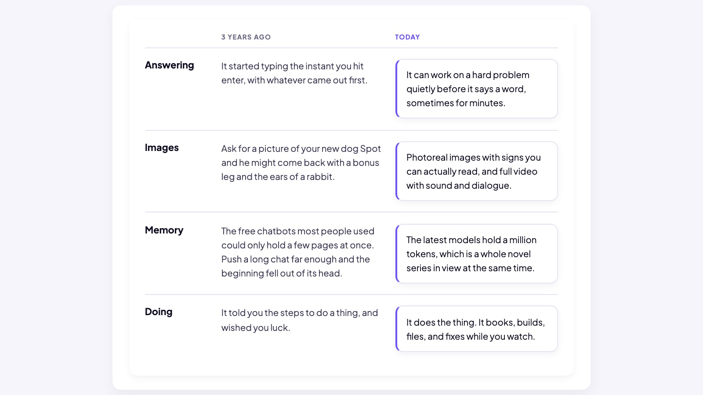
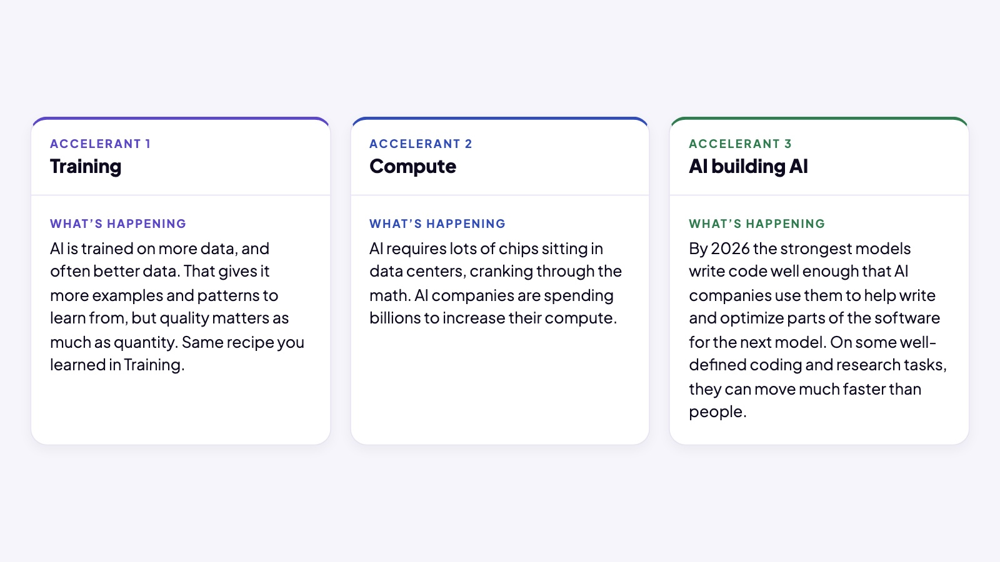
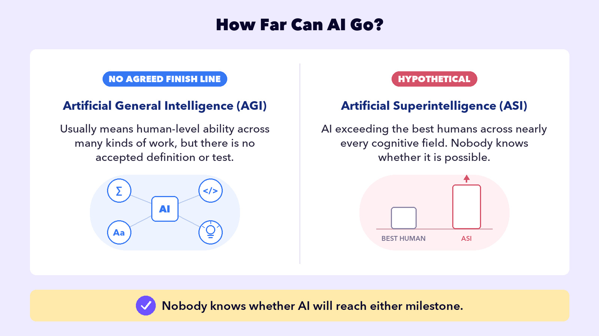
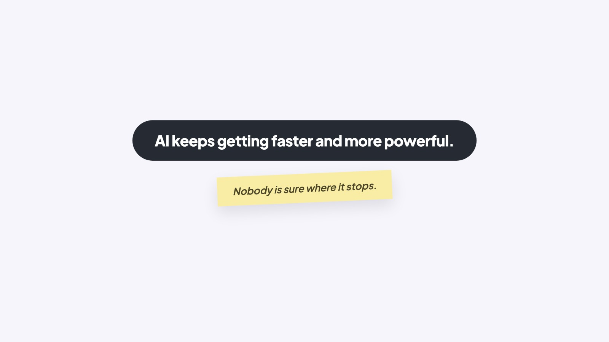

## EMBRACE THE FUTURE

# Pace of Change

The AI argument is getting louder and louder. Why? Because the technology is advancing at blazing speeds.

### Board 1: ChatGPT: 2023 vs. 2026

**Image file:** `pace-of-change-1-three-years.jpg`

**Teaching content:**

Four rows compare 2023 with 2026.

Answering. In 2023 it started typing the instant you hit enter, with whatever came out first. In 2026 it can work on a hard problem quietly before it says a word, sometimes for minutes.

Images. In 2023, ask for a picture of your new dog Spot and he might come back with a bonus leg and the ears of a rabbit. In 2026, photoreal images with signs you can actually read, and full video with sound and dialogue.

Context window. In 2023 the free chatbots most people used could only hold a few pages at once; push a long chat far enough and the beginning fell out of its head. In 2026 some models can hold a million tokens, which is a whole novel series in view at the same time.

Doing. In 2023 it told you the steps to do a thing, and wished you luck. In 2026 it does the thing. AI agents can even book, build, and fix while you watch.

The AI companies are in a race to dominate the industry, so they release new models every couple of months. Each new ChatGPT, Claude, or Gemini release is a new, stronger LLM replacing the one before it. A limitation can disappear quickly, so today’s “no” is not necessarily permanent.

## WHY SO FAST?

Three concepts are driving the acceleration, and you already understand the first one.

### Board 2: Why So Fast?

**Image file:** `pace-of-change-2-accelerants.jpg`

**Teaching content:**

Better training: AI learns from more and better data. That translates into better results.

More compute: AI requires lots of chips sitting in data centers. AI companies are spending billions to increase their compute.

AI helps build AI: the strongest AI models help people write code for the next models. On well-defined tasks, they can move much faster than people.

Slow down and read that third one again. AI is already helping people build better AI.

## 4 FUTURE IDEAS

What does the future of AI look like? There are four key ideas driving the AI companies forward. One is happening in limited form. The other three describe a proposed process or possible milestones that have not been demonstrated.

### Board 3: Could AI Improve Itself?

**Image file:** `pace-of-change-3-future-research.jpg`

**Teaching content:**

Automated AI research is happening in limited form: AI can write code, run experiments, and analyze results. Researchers still set the goals, direct the work, and verify the results.

Self-improving AI has not been demonstrated: an AI would improve its own design, the stronger version would do it again, creating a loop with little or no human direction.

One is human-directed. The other would be a self-reinforcing loop.

### Board 4: How Far Can AI Go?

**Image file:** `pace-of-change-4-future-capability.jpg`

**Teaching content:**

Artificial General Intelligence, AGI, usually means human-level ability across many kinds of work, but there is no accepted definition or test.

Artificial Superintelligence, ASI, is the hypothetical idea of AI exceeding the best humans across nearly every cognitive field.

Nobody knows whether AI will reach either milestone.

### Close

**Image file:** `pace-of-change-5-close.jpg`

## Closing Message

AI keeps getting faster and more powerful.

Nobody is sure where it stops.
