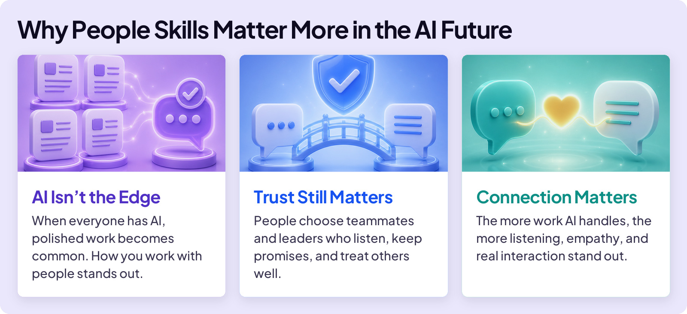
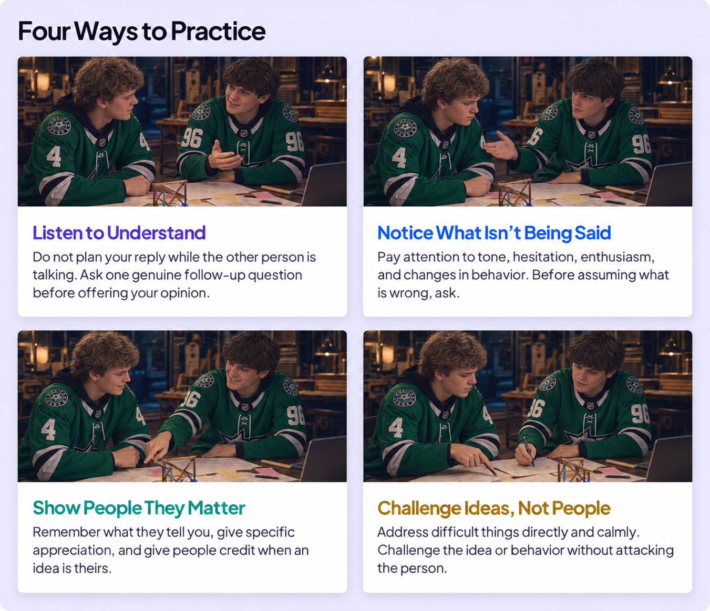
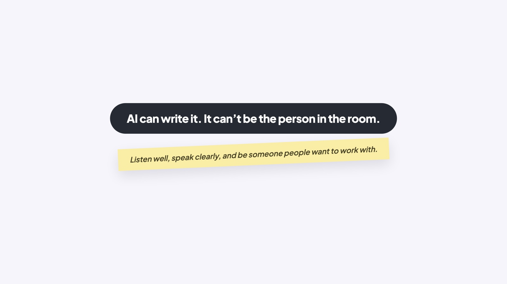

## BUILD YOUR SKILLS

# People Skills

AI can do amazing things. But there is one thing it doesn’t replace: people.

People need people. We always have. Long before modern technology, survival depended on working together, trusting one another, and understanding what others needed.

People skills help you understand, communicate with, and work alongside other people. They include listening, empathy, explaining clearly, reading the room, and earning trust.

It’s easy to spot who has great people skills. They’re who you want in your group, talk to when something is wrong, and trust to help when things are difficult.

### Board 1: People Skills Matter More

**Image file:** `people-skills-1-why-matter.jpg`

**Teaching content:**

AI isn’t the edge: when everyone has AI, polished work becomes common. How you work with people stands out.

Trust still matters: people choose teammates and leaders who listen, keep promises, and treat others well.

Connection matters: the more work AI handles, the more listening, empathy, and real interaction stand out.

You do not need a special class to start. People skills grow through everyday interactions. Try these during your next group project, club meeting, practice, or job.

### Board 2: Four Ways to Practice

**Image file:** `people-skills-2-four-ways.jpg`

**Teaching content:**

Listen to understand: do not plan your reply while the other person is talking. Ask one genuine follow-up question before offering your opinion.

Notice what isn’t being said: pay attention to tone, hesitation, enthusiasm, and changes in behavior. Before assuming what is wrong, ask.

Show people they matter: remember what they tell you, give specific appreciation, and give people credit when an idea is theirs.

Challenge ideas, not people: address difficult things directly and calmly. Challenge the idea or behavior without attacking the person.

AI can suggest what to say. It cannot understand the person for you, earn someone’s trust, or do the rep for you.

### Board 3: Close

**Image file:** `people-skills-3-close.jpg`

## Closing Message

AI can write it. It can’t be the person in the room.

Listen well, speak clearly, and be someone people want to work with.
