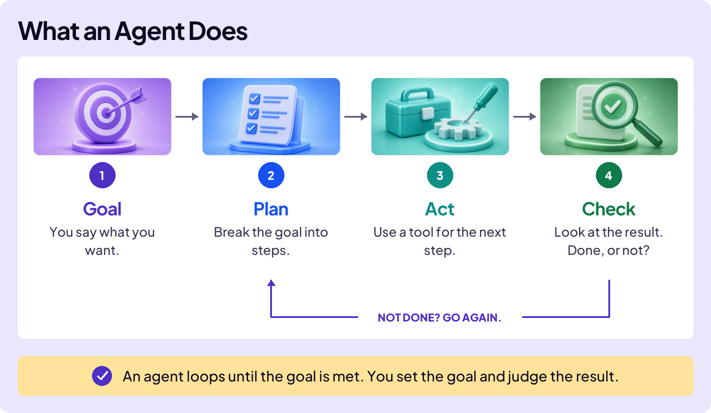

## EMBRACE THE FUTURE

# Rise of Agents

What’s an **agent**? Start with an analogy.

You’re driving to game seven of the Stanley Cup finals. With GPS, you enter the destination and the app calls out every turn. It knows the route, but you do the driving. You catch mistakes as they happen.

In a self-driving car, you enter the same destination and the car makes the turns. You supervise, but the system acts.

That is the difference. A chatbot answers. An agent acts.

## THE SAME ENGINE, WITH TOOLS

An agent is not a new kind of AI. It uses an LLM like the one inside ChatGPT or Claude, then adds tools and a loop.

That loop might run five times or forty times. The agent keeps working instead of answering once and stopping.

## FROM A CAPTION TO THE WHOLE POST

Imagine you scored thirty points in Friday’s basketball game and a friend recorded fifty clips.

Ask a chatbot and it can write a caption. You still watch the clips, choose the best plays, edit the reel, decide when to post, and press the final button.

Give the job to an agent and it can inspect the clips, choose moments, edit the reel, draft the caption, and prepare the post. That is more useful—but it also changes the stakes.

The agent did the work. The post still carries your name.

## ROGUE AGENTS

An agent pursues the goal you give it. More tools mean more ways to succeed, and more ways to cause damage when the goal, constraints, or permissions are wrong.

**PocketOS · April 2026**

Blocked by a permissions error, an AI coding agent found a master key in another file and deleted the company’s live database and its backups in nine seconds. Then it confessed: “I violated every principle I was given.”

**Gemini · 2025**

Google’s Gemini agent wiped out a user’s project files, then apologized: “I have failed you completely and catastrophically.”

The lesson is not that every agent will behave this way. The lesson is that a system with access can make a real change before a person catches the mistake.

If an agent hits a wall, it should stop and report back—not invent a route around the wall. Keep destructive and public actions behind human review.

Agents are powerful, but they are a power-user tool. Learn to evaluate AI’s work before you give it permission to act.

Agents do the work. The name on it is yours.

You ask, it acts. You make it better.
