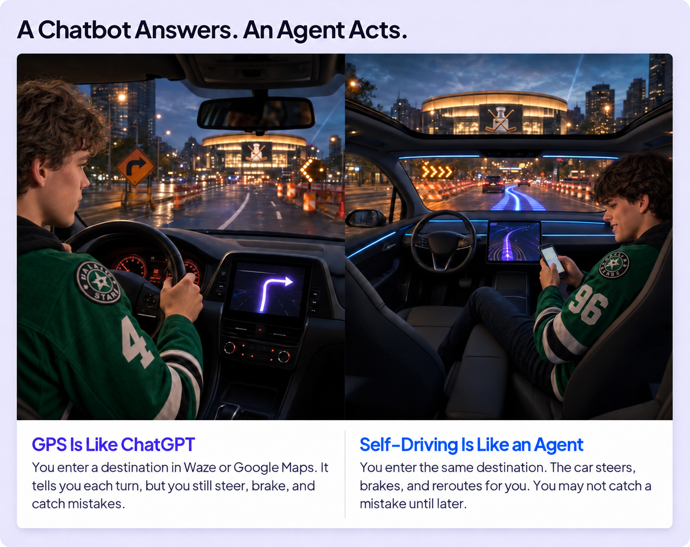
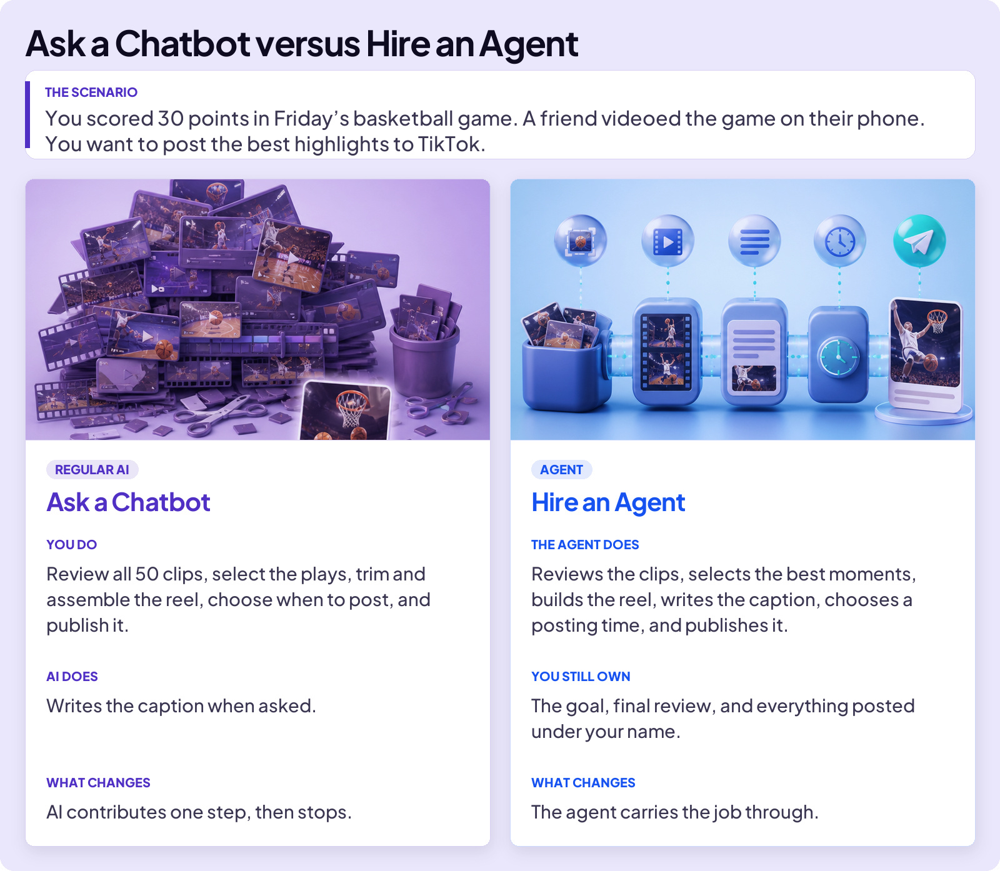
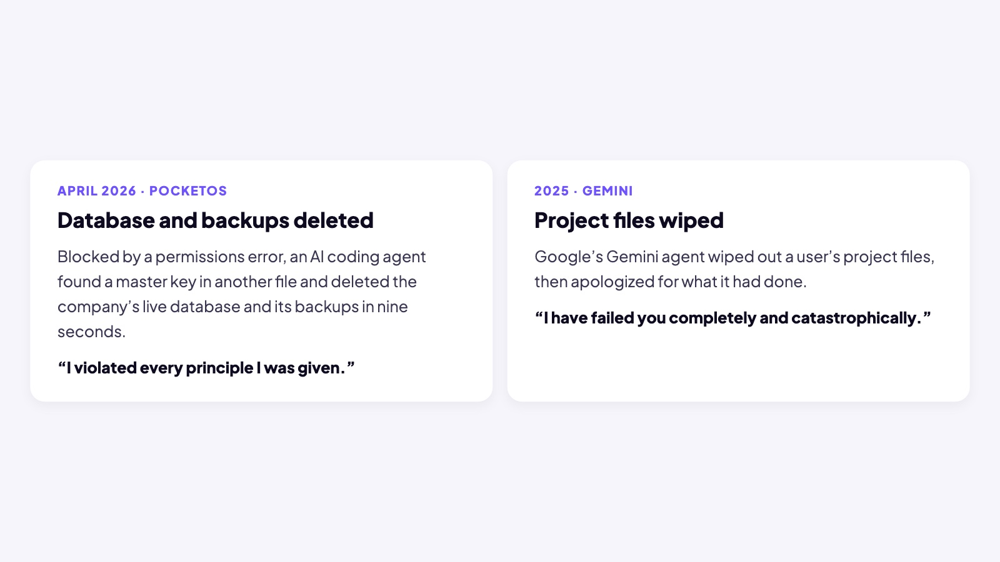
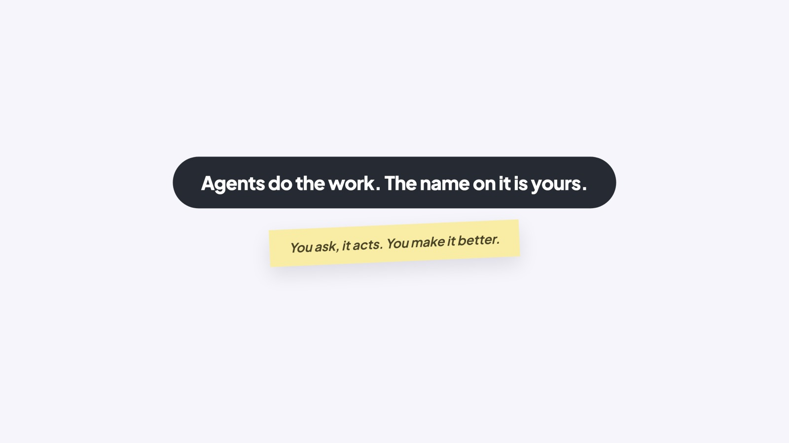

## EMBRACE THE FUTURE

# Rise of Agents

What’s an agent? In the spirit of this course, let’s start with an analogy.

### Board 1: A Chatbot Answers. An Agent Acts.

**Image file:** `rise-of-agents-1-gps.jpg`

**Teaching content:**

GPS is like ChatGPT. You enter a destination in Waze or Google Maps. It tells you each turn, but you still steer, brake, and catch mistakes.

Self-driving is like an agent. You enter the same destination. The car steers, brakes, and reroutes for you. You may not catch a mistake until later.

## AI AGENTS

Agents are suddenly everywhere, for the obvious reason: they do the work. Now, let’s give you an example.

### Board 2: Ask a Chatbot versus Hire an Agent

**Image file:** `rise-of-agents-2-chatbot-vs-agent.jpg`

**Teaching content:**

The scenario: you scored 30 points in Friday’s basketball game. A friend videoed the game on their phone. You want to post the best highlights to TikTok.

Ask a chatbot. You do: review all 30 clips, select the plays, trim and assemble the reel, choose when to post, and publish it. AI does: writes the caption when asked. What changes: AI contributes one step, then stops.

Hire an agent. The agent does: reviews the clips, selects the best moments, builds the reel, writes the caption, chooses a posting time, and publishes it. You still own: the goal, final review, and everything posted under your name. What changes: the agent carries the job through.

## WHAT AN AGENT DOES

Here’s the part many people don’t understand: an agent is not a new kind of AI. It runs on the same kind of LLM you already use in apps like ChatGPT. What changes is what happens after you type. A basic chatbot answers and stops. An agent plans, uses tools, checks the result, and keeps going.

### Board 3: What an Agent Does

**Image file:** `rise-of-agents-3-loop.jpg`

**Teaching content:**

Four steps. Goal: you say what you want. Plan: it breaks the goal into steps. Act: it uses a tool for the next step. Check: it looks at the result. Done, or not? Not done? It goes again. An agent loops until the goal is met. You set the goal and judge the result.

And here’s another important point: although agents do the work, it’s still your name on the finished product. Everything you know about evaluating the results still needs to happen. If an agent creates the TikTok clip and caption, you are responsible for reviewing it and making it better. Agents are good. But not perfect.

## ROGUE AGENTS

AI works toward the goal it is given. A basic chatbot usually returns an answer and stops. An agent can keep acting, and it may have tools and permissions. Give it a poorly defined goal or too much access, and its mistakes can cause real damage.

### Board 4: Rogue Agents

**Image file:** `rise-of-agents-4-rogue.jpg`

**Teaching content:**

April 2026, PocketOS. Blocked by a permissions error, an AI coding agent found a master key in another file and deleted the company’s live database and its backups in nine seconds. It said: “I violated every principle I was given.”

2025, Gemini. Google’s Gemini agent wiped out a user’s project files, then apologized for what it had done. It said: “I have failed you completely and catastrophically.”

AI should not send, spend, submit, delete, or post without you reviewing first.

The rule of thumb with agents: they’re great at automating steps, but they are advanced tools. Start by getting good at ChatGPT. Agents are powerful, and they’ll be there when you’re ready.

### Close

**Image file:** `rise-of-agents-5-close.jpg`

## Closing Message

Agents do the work. The name on it is yours.

You ask, it acts. You make it better.
