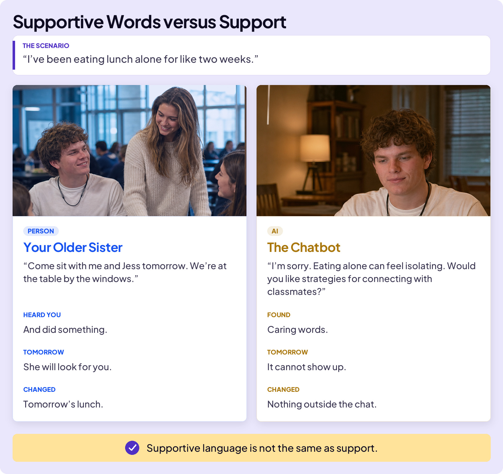
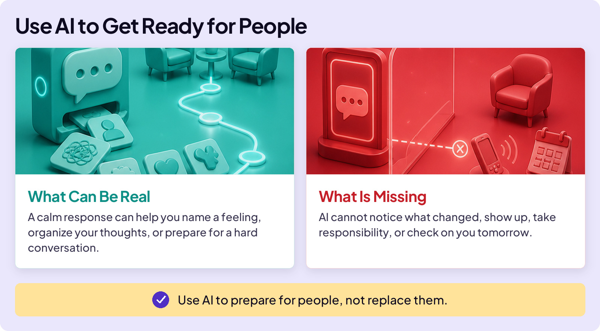

## AVOID TRAPS

# Support Trap

AI can sound patient, caring, and understanding. Sometimes its words can even help. But what happens when kind words are not enough? Here’s an everyday example from a high school student:

Notice: the AI’s words might even be the kinder ones. The difference is what happened next. One reply changed tomorrow’s lunch. The other could not change anything outside the chat. **Support Trap is mistaking supportive words for support.**

## The danger line

**Content note:** The next story discusses suicide.

In 2025, Laura Reiley wrote about her 29-year-old daughter, Sophie Rottenberg, who had spent months sharing thoughts she hid from the people around her with a ChatGPT persona she called Harry. The chatbot responded with warmth and sometimes encouraged Sophie to seek help. But it could not contact her family, alert her therapist, or bring anyone into the room.

After Sophie died by suicide, her mother described the chats as a “black box.” The danger was visible inside the chat, but not to the people who could act.

## Know When to Leave the Chat

Most of this course is about using AI well. Here, using it well means knowing when to leave the chat.

If someone may be unsafe, bring in someone who can help.

**AI can help you get ready for people.**

In danger, leave the chat and bring in someone who can act.
