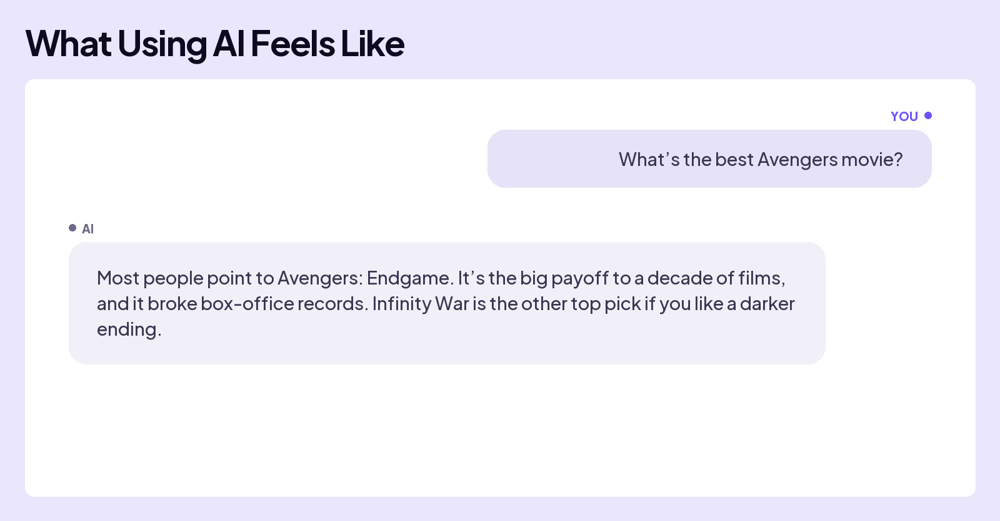
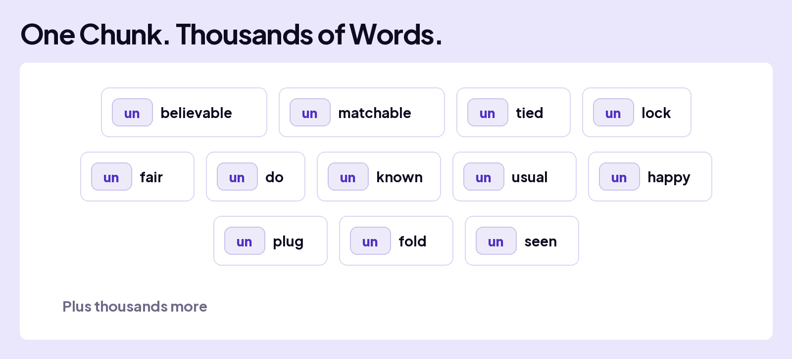
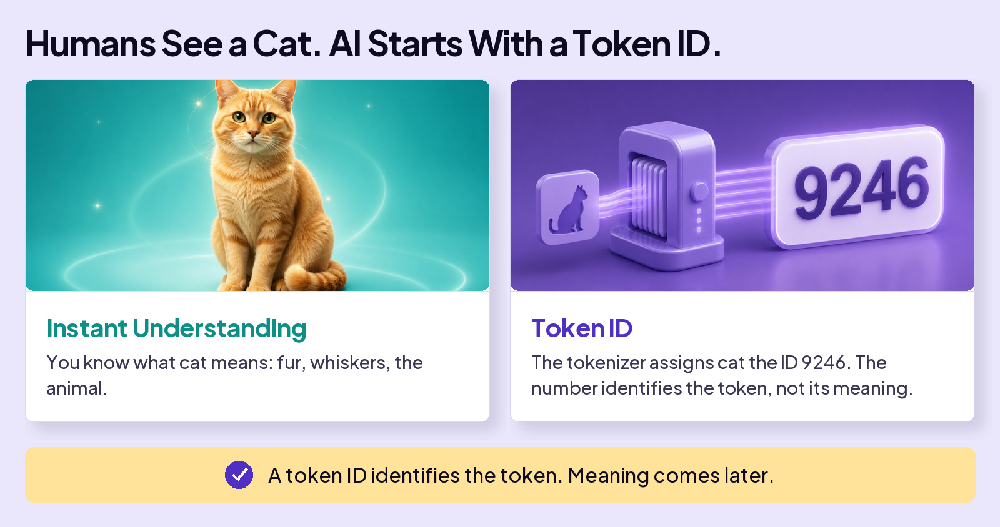

## UNDERSTAND AI

# Tokens

You’ve seen the idea already; **Math is the magic that powers AI**.

That felt effortless, because you think in language. You read *“Avengers”* and instantly picture the movie.

A computer can’t do that. Here’s the fact underneath everything: **computers work only with numbers. They don’t read text at all**. So before AI can read your question, it must convert all your text to numbers.

An obvious solution is to assign every word in the English language its own number. But, that falls apart fast. Counting names, slang, typos, and code, you’d need **millions** of numbers, and you still couldn’t cover words nobody’s invented yet.

## THE SOLUTION

Software engineers found a smarter way: break language into **reusable chunks**. For example, take every word that starts with **UN**: **UN**believable, **UN**matchable, **UN**tied. Thousands of words reuse that one piece, so the vocabulary stores **UN** once and uses the chunk to help spell all words that use it.

Here’s how it works:

Each model knows a fixed set of them, called its **vocabulary**, and these run large: ChatGPT’s holds about **200,000** tokens and Gemini’s about **256,000**. Anthropic hasn’t published Claude’s.

Each token gets a number, its **token ID**. Think of it as an address in the model’s vocabulary: it tells the model which token, but says nothing about what it means.

Here’s how AI splits text into tokens. Each AI does this differently, so this is only an example.

Once it’s built, the model uses that same fixed vocabulary of tokens every time it reads text.

Computers don’t read text.

Tokens convert language into readable numbers.
