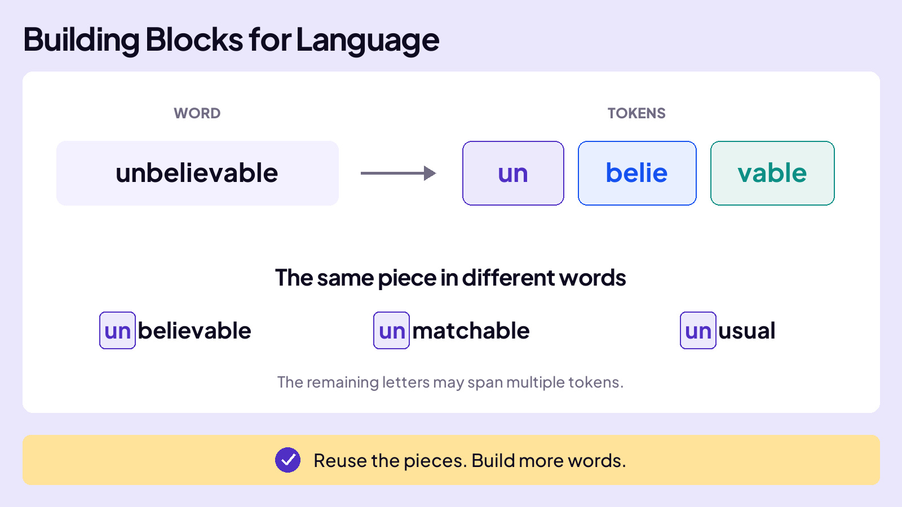
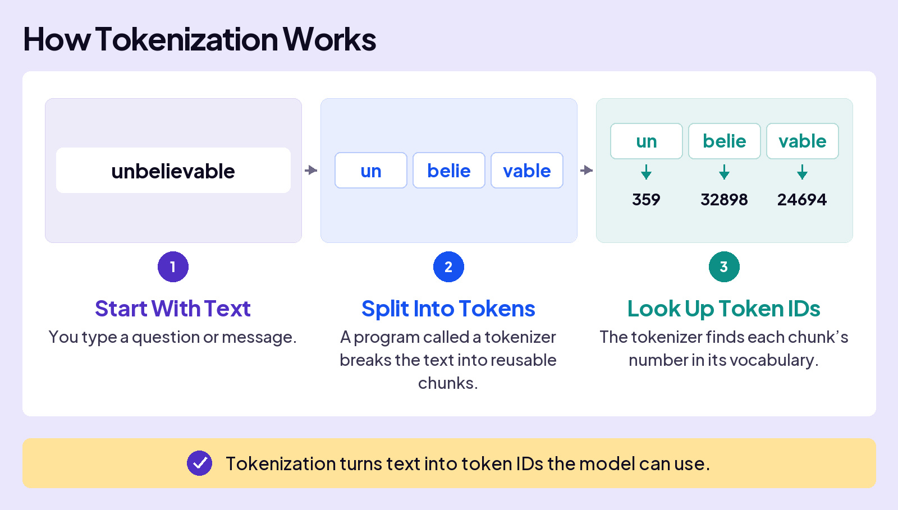
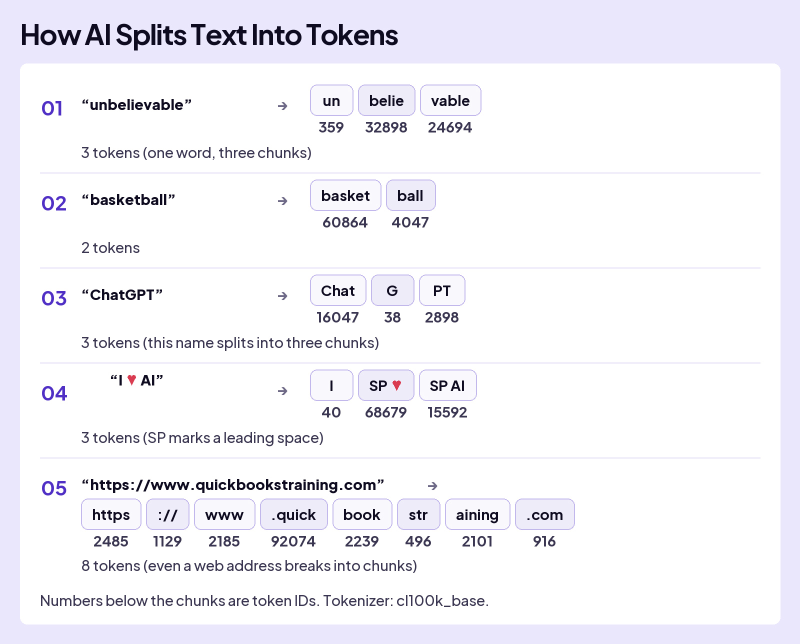

## UNDERSTAND AI

# Tokens

**Math is the magic that powers AI.** But you ask AI questions in words, not numbers.

### Board 1: You Use Words. AI Uses Numbers.

**Image file:** `tokens-using-ai-feels-like-editorial.jpg`

**Teaching content:**

**You:** “What’s the best Avengers movie?”

**AI:** “Most people point to Avengers: Endgame. It’s the big payoff to a decade of films, and it broke box-office records. Infinity War is the other top pick if you like a darker ending.”

You ask in words and receive an answer in words. The lesson now asks how those words become numbers AI can use.

How do your words become numbers that AI can use?

One idea is to assign each word in every language a unique number. That way, you type the word, AI gets a number.

But that breaks down fast. People keep inventing words, names, and slang. They also make typos and include things like emojis and code. Even a list of a million words couldn’t cover everything a person might type.

## WORDS INTO PIECES

Instead of giving every word its own number, AI uses reusable pieces of text called **tokens**. Think of them as building blocks for language. A token can be a whole word or just part of one. The full collection of tokens is called the model’s **vocabulary**. The same pieces can combine in different ways, so the vocabulary doesn’t need a new entry for every new word. For example, **un** can be reused in **unbelievable** and **unusual**.

### Board 2: Building Blocks for Language

**Image file:** `tokens-building-blocks-notebook.jpg`

**Teaching content:**

The word **unbelievable** is built from the pieces **un**, **belie**, and **vable** in this example.

The piece **un** can be reused in **unbelievable**, **unmatchable**, and **unusual**. The remaining letters may span multiple tokens. The vocabulary can reuse a piece instead of storing a separate entry for every whole word.

**Takeaway:** Reuse the pieces. Build more words.

## WHERE THE PIECES COME FROM

When setting up AI, engineers choose how text will be split into tokens and how large the vocabulary will be. A program analyzes a large collection of text to build that vocabulary. Each token gets a number, its **token ID**. Think of it as an address in the vocabulary: it identifies the token, but says nothing about what it means. The model uses those same tokens and IDs during training and when you chat.

These vocabularies can be large: ChatGPT’s holds about **200,000** tokens and Gemini’s about **256,000**. Anthropic hasn’t published Claude’s.

### Board 3: What Happens When You Hit Send

**Image file:** `tokens-how-tokenization-works-editorial.jpg`

**Teaching content:**

1. **Start With Text:** You type a question or message.
2. **Split Into Tokens:** A program called a **tokenizer** breaks the text into reusable chunks.
3. **Look Up Token IDs:** The tokenizer finds each chunk’s number in its vocabulary.

For the word **unbelievable**, this cl100k_base example uses:

| Token | Token ID |
| --- | --- |
| un | 359 |
| belie | 32898 |
| vable | 24694 |

**Takeaway:** Tokenization turns text into token IDs the model can use.

### Board 4: Humans See a Cat. AI Starts With a Token ID.

**Image file:** `tokens-cat-token-id-editorial.jpg`

**Teaching content:**

**Instant Understanding:** You know what cat means: fur, whiskers, the animal.

**Token ID:** Here, the tokenizer converts the written word **cat** to ID **4719**, using cl100k_base. The number identifies the token, not its meaning.

**Takeaway:** A token ID identifies the token. Meaning comes later.

All the text you send to AI gets split into tokens. Here are some examples.

### Board 5: How AI Splits Text Into Tokens

**Image file:** `tokens-how-ai-splits-text-verified-editorial.jpg`

**Teaching content:**

These examples use the cl100k_base tokenizer. On this board, **SP** is only a visual label for a leading space; it is not text the tokenizer inserts. In **I ♥ AI**, the space and heart form one token, and the next space and **AI** form another. Including **I**, that makes three tokens. Numbers below the chunks on the board are token IDs.

| Text | Tokens, in order | Token IDs, in the same order | Count |
| --- | --- | --- | --- |
| unbelievable | un · belie · vable | 359 · 32898 · 24694 | 3 |
| basketball | basket · ball | 60864 · 4047 | 2 |
| ChatGPT | Chat · G · PT | 16047 · 38 · 2898 | 3 |
| I ♥ AI | I · SP ♥ · SP AI | 40 · 68679 · 15592 | 3 |
| https://www.quickbookstraining.com | https · :// · www · .quick · book · str · aining · .com | 2485 · 1129 · 2185 · 92074 · 2239 · 496 · 2101 · 916 | 8 |

One word can contain several tokens. A token can include a space before a word or symbol. Names and web addresses also split into pieces.

## HOW THE ANSWER BECOMES WORDS AGAIN

When AI replies, its answer comes out as token IDs. The tokenizer converts those IDs back into pieces of text and joins them together into the answer you read.

## Closing Message

Words become numbers.

That lets AI work with your language using math.
