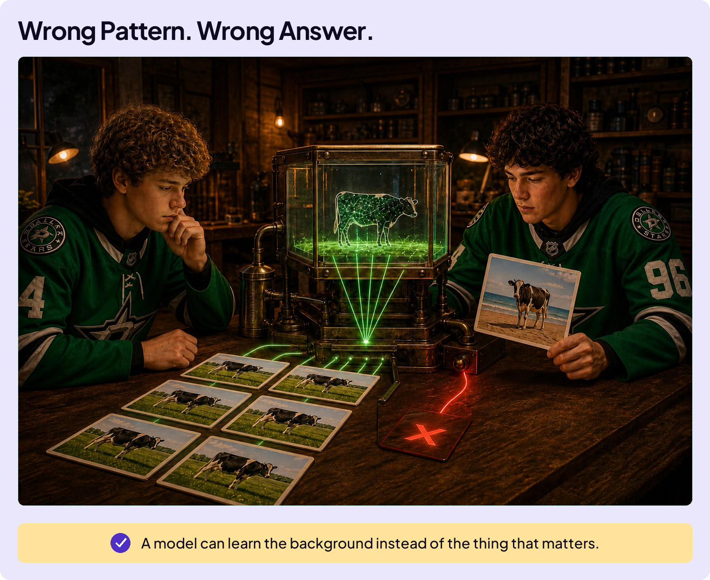
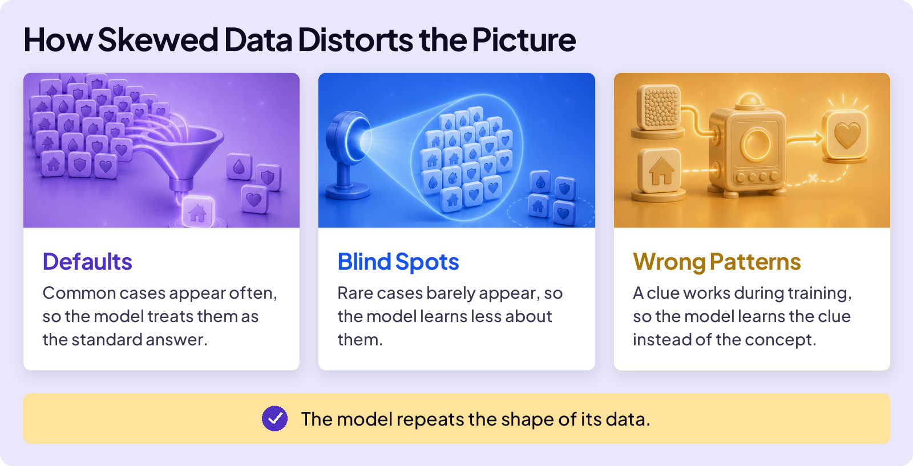
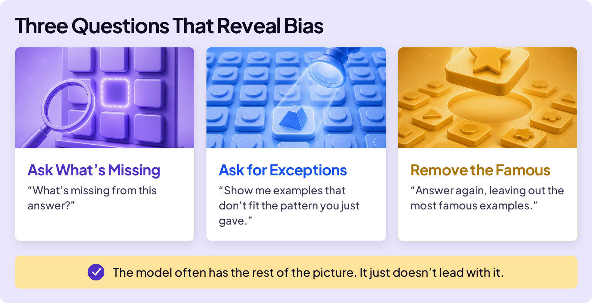
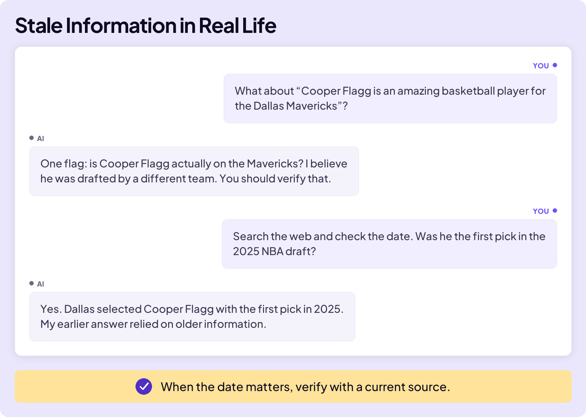
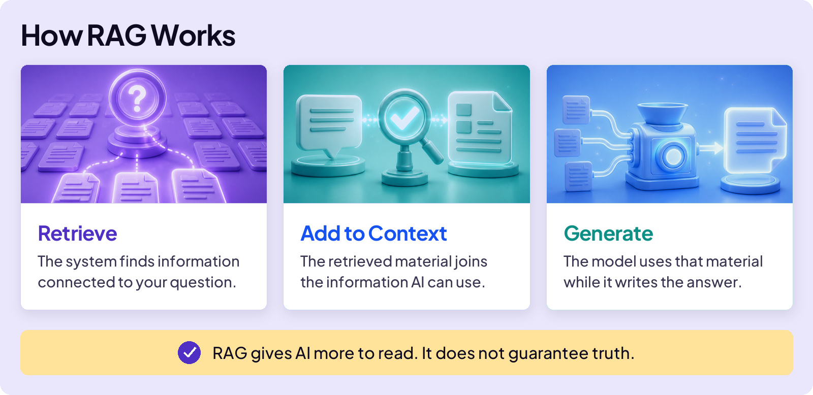

## AVOID TRAPS

# Training Bias

Sometimes AI doesn’t invent anything. Every fact in an answer can be real, but the picture can still be distorted.

## Cows on the Beach

Computer-vision researchers saw a famous version of this. A model could recognize cows in familiar photos. Then researchers showed it cows in unusual settings, including a beach, and its performance fell apart. Same animal. Different background.

Most of the cows it learned from appeared on green pasture. The model had picked up a shortcut: green grass means cow. It learned the background along with the animal.

This is training bias. The data showed the model a narrow slice of reality, so the model treated that slice as the whole picture.

Training data can create two different traps. It can be skewed, so AI sees a distorted picture. It can also be stale, so AI sees an old picture.

## How Skewed Data Distorts the Picture

Skewed data creates three overlapping problems.

These patterns can have real consequences. Researchers have found major accuracy gaps across demographic groups in some facial-analysis systems. Face-recognition errors have even contributed to wrongful arrests. The stakes are much higher than a cow photo.

You cannot fact-check your way out of this trap because every individual fact may be correct. Look for sameness. **When every example looks alike, you are seeing the model’s default, not the world.** When you spot it, three questions can reveal what the first answer left out:

## When Training Data Gets Old

Skewed data gives AI a distorted picture. Old data gives it an outdated one.

Training eventually stops. Anything that happens afterward was not part of its training, so it may be missing from the answer. This is a different training-data problem. It is stale information, not a hallucination.

We encountered it while building this course. We asked Claude to check an example sentence from the Tokens lesson:

Claude answered from older information without searching first. Once we asked it to check a current source, it corrected itself. When the date matters, that is your move too.

## When AI Looks Something Up

AI does not always have to answer from training alone. It can retrieve outside information first, add that information to its context, and then build an answer from it.

This approach is called **Retrieval-Augmented Generation**, or **RAG**:

RAG is especially useful when information changed after training. But it only gives AI more to read. It does not guarantee that the source is reliable or that AI interprets it correctly.

**AI repeats the shape of its data.**

Ask what’s missing. Check what’s changed.
