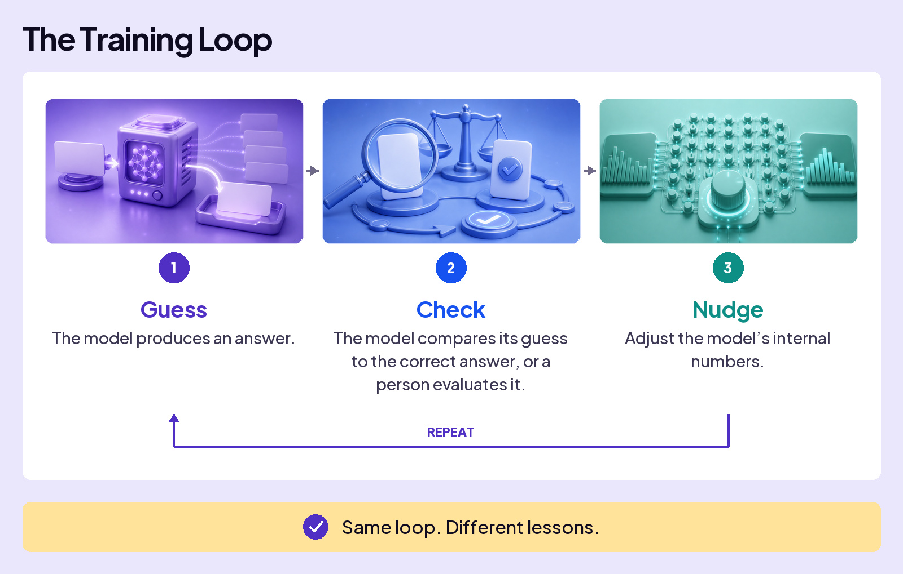
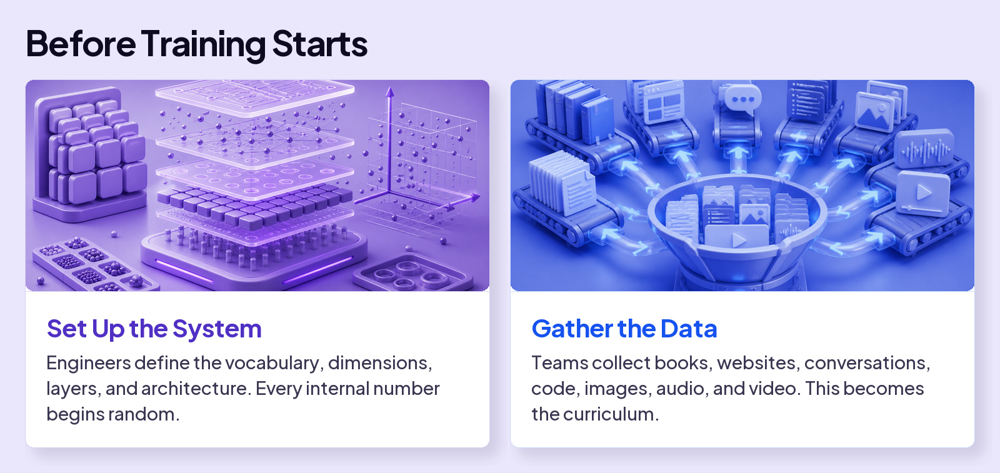
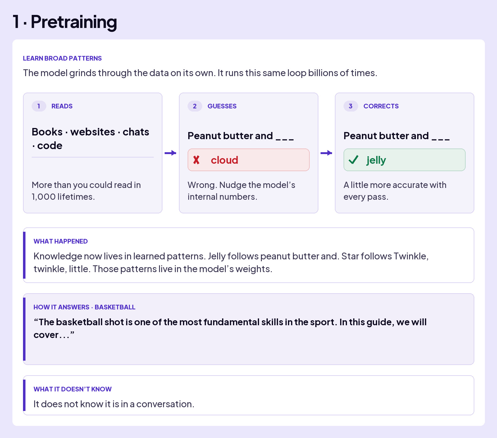
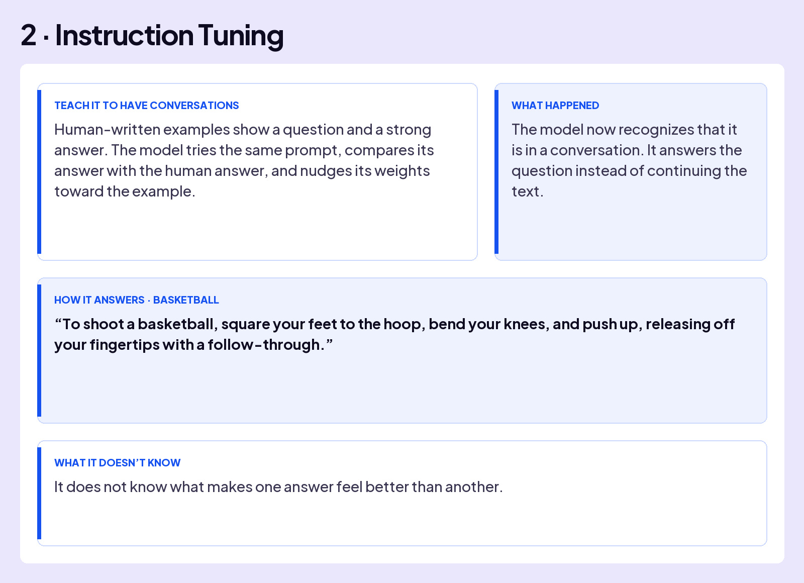
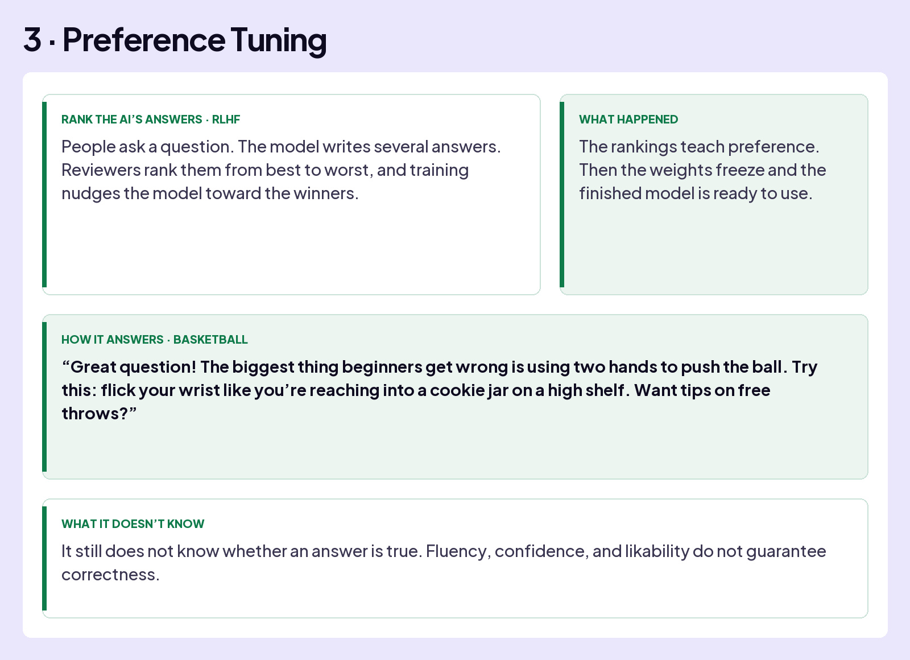
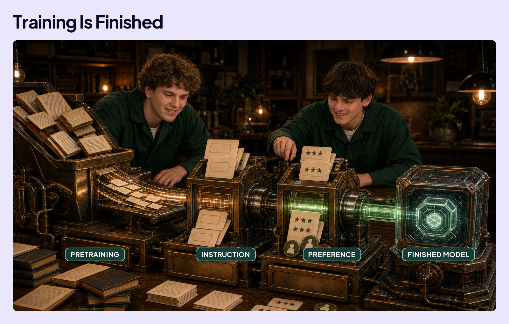

## UNDERSTAND AI

# Training

You’ve seen the word **training** come up again and again throughout this course. It’s how OpenAI, Anthropic, and Google build AI: the same guess, check, and nudge loop you saw back in How an LLM Works.

Training happens in three phases, but it can’t start cold. Think of a basketball coach: before the first practice, they need a court and equipment, and a plan for what the team will actually work on. AI needs the same setup.

## THREE PHASES OF TRAINING

Now, AI is ready to learn. The first phase is called “Pretraining.” Don’t let the name fool you. The “pre” just means it comes before the phases where humans teach it directly. You’ll also see how the model answers the same question at each phase: “How do I shoot a basketball?”

When training is finished, the core model becomes a kind of snapshot. It has learned patterns from the data it saw up to a certain point. That is why models can have **knowledge cutoffs**. They can add live search, files, memory, or tools, but the core model is finished learning.

AI learned patterns, not facts.

Fluency comes free. Being right doesn’t.
