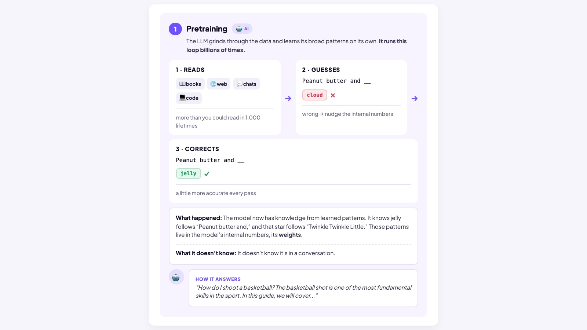

## UNDERSTAND AI

# Training

AI can explain chemistry, write code, and help you improve an essay. How did it learn to do those things?

Think about learning to shoot a basketball. You try, see how you did, and make an adjustment.

AI also learns through repeated attempts. Let’s follow the process from preparation to a model that is ready to use.

### Board 1: Before Training Starts

**Image file:** `training-before-starts.jpg`

**Teaching content:**

Two things happen before training starts.

First, set up the system. Engineers design the model and give its internal numbers starting values. Training will adjust those numbers as the model learns.

Second, gather the data. Teams collect books, websites, conversations, code, images, audio, and video. This becomes the curriculum.

## Three Phases

Training builds different abilities in three main phases. We’ll use the same basketball question to see what each phase adds.

### Board 2: Three Phases of Training

**Image file:** `training-three-phases.jpg`

**Teaching content:**

We’ll compare what the model can do after each phase using the same question:

“How do I shoot a basketball?”

Phase 1 is Pretraining. Learn patterns from data.

Phase 2 is Instruction Tuning. Learn to follow instructions.

Phase 3 is Preference Tuning. Improve responses through feedback.

## A Shared Training Loop

Across all three phases, training follows a basic loop: guess, check, and adjust. What changes is the examples and feedback used to guide those adjustments. Here’s a simple example.

### Board 3: The Training Loop

**Image file:** `training-guess-check-adjust.jpg`

**Teaching content:**

Here is one training example: the phrase “Peanut butter and jelly.”

Step one is Guess. Given ‘Peanut butter and ___,’ the model guesses cloud.

Step two is Check. The example says jelly. Compare the guess with that word.

Step three is Adjust. Adjust the model’s internal numbers to make jelly more likely in this situation.

Then repeat. The loop runs again on the next example.

## From the Loop to Pretraining

Those adjustments change the model’s internal numbers, called weights. Now, let’s look at the first phase of training, called pretraining.

### Board 4: 1 · Pretraining

**Image file:** `training-pretraining.jpg`

**Teaching content:**

Here is what pretraining builds.

Learning from more text than you could read in 1,000 lifetimes.

Across vast amounts of text and code, the model learns patterns in language and information. These patterns help it write sentences, explain ideas, and produce code. The result is a broad foundation that later training can shape into a more useful assistant.

After pretraining, here is what an answer might look like for the basketball question:

“The basketball shot is one of the most fundamental skills in the sport. In this guide, we will cover...”

What still needs work: the model can produce fluent text, but it doesn’t reliably follow your instructions yet.

## From Patterns to Instructions

Training keeps adjusting the model’s weights. What changes in the next phases is the kind of examples and feedback used to guide those adjustments.

### Board 5: 2 · Instruction Tuning

**Image file:** `training-instruction-tuning.jpg`

**Teaching content:**

Phase 2 is Instruction Tuning. In this phase, the model will learn to follow instructions.

People provide questions paired with helpful example answers. The model practices answering those questions, comparing its guesses with the examples. Training adjusts its weights so its answers become more like those examples.

After instruction tuning, here is what an answer might look like for the basketball question:

“To shoot a basketball, square your feet to the hoop, bend your knees, and push up, releasing off your fingertips with a follow-through.”

What still needs work: the model can follow a request, but its answer may still be unclear, incomplete, or unhelpful.

## From Instructions to Feedback

Following instructions is a start. Next, the model learns from feedback about which answers people find more helpful. That’s preference tuning.

### Board 6: 3 · Preference Tuning

**Image file:** `training-preference-tuning.jpg`

**Teaching content:**

Phase 3 is Preference Tuning. In this phase, the model will learn from feedback.

People provide a question, and the model produces several answers. People compare the answers and select the one they think is best, looking for clear, useful, and accurate information. Training adjusts the model’s weights to make answers like the selected one more likely.

After preference tuning, here is what an answer might look like for the basketball question:

“Great question! Start close to the hoop. Use one hand to shoot and the other to steady the ball. Bend your knees, then push up as you shoot. Finish with your wrist bent and your fingers pointing toward the hoop. Practice from the same spot before moving farther away.”

What still needs work:

Feedback helps improve the answers, but AI can still give a wrong answer that sounds right.

## When Training Ends

When training ends, the model is ready to use. During a normal chat, it uses the weights that training produced.

It can work with new information you give it, but your conversation does not change those weights.

## Closing Message

AI learns from examples and feedback.

Guess. Check. Adjust. Repeat.
