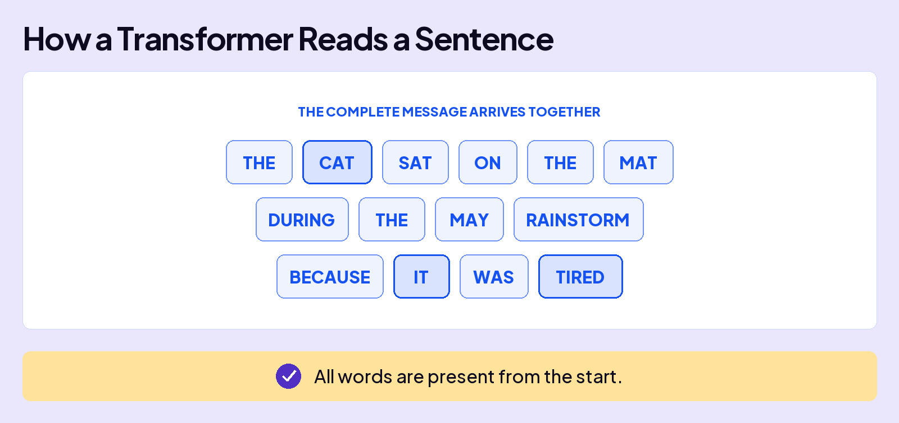

## UNDERSTAND AI

# Transformer

When you type a message to ChatGPT, you use words, and it responds with words. Underneath, AI splits your text into small pieces called **tokens**. Each token has an **embedding**, a row of numbers that represents its starting meaning.

These two examples show how the surrounding words, or **context**, shape meaning. AI works with tokens, but we’ll use whole words to make the connections easier to see.

## WHY THIS WAS HARD FOR AI

Our human brains see the right meaning instantly from the surrounding words. For earlier AI, this was a challenge because it read text in order, one word at a time. The further it read, the more the early words faded.

## THE BREAKTHROUGH

In 2017, eight researchers at Google published a paper called **Attention Is All You Need**. It introduced the **Transformer**, a widely used architecture for large language models, and the “T” in ChatGPT.

The Transformer reads your whole message at once. In our example, **IT** can draw on information from the earlier word **CAT**, even with several words in between.

Reading your whole message at once is only the start. AI needs to figure out which words matter and use that information to update the numbers. In our example, **IT** needs information from **CAT** to help represent what it refers to in this sentence. Attention and transformation work together to make that happen.

Now let’s return to our two examples.

Attention and transformation also help AI interpret sarcasm, idioms, and even an “it” that points to nothing at all, as in “it was a cold day.”

## One catch: word order

Reading everything at once creates a problem that reading in order never had. Consider a simple sentence: “Dog bites man.” Same three tokens. Same starting embeddings. But the order carries the meaning.

Attention is all you need.

AI uses relationships between words to help interpret your message.
