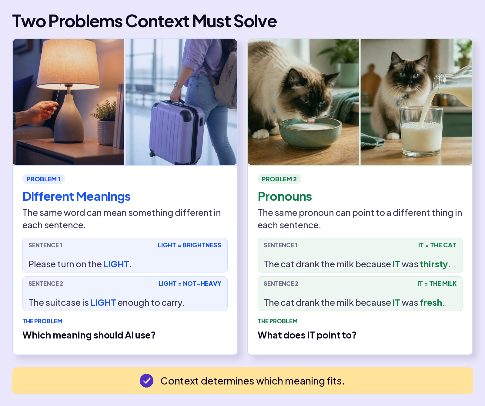
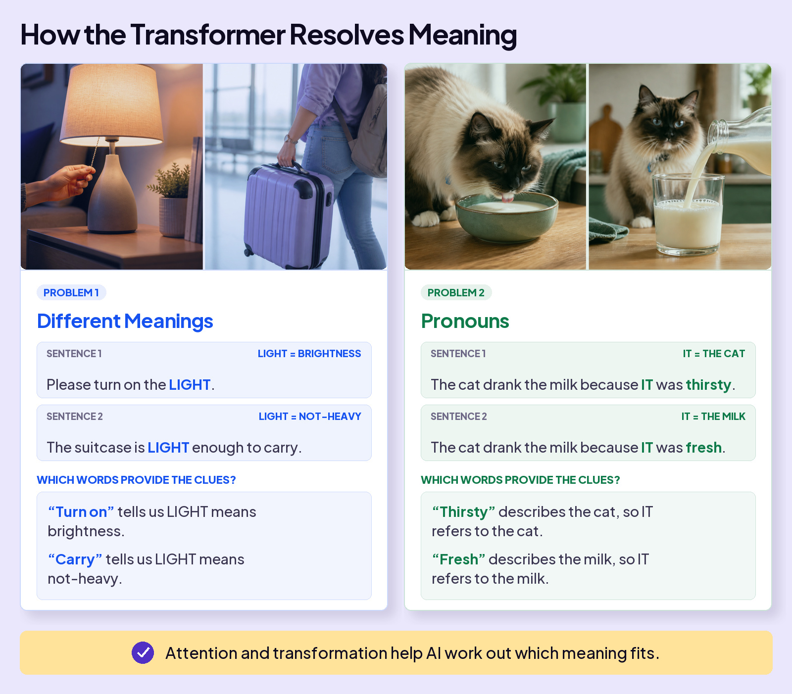
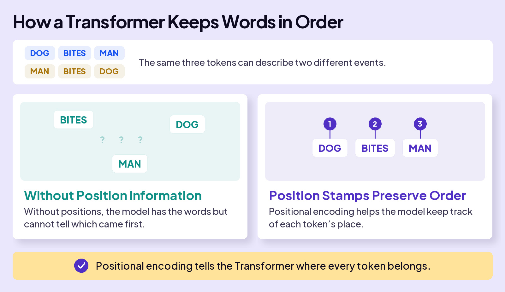

## UNDERSTAND AI

# Transformer

When you type a message to ChatGPT, you use words, and it responds with words. Underneath, AI splits your text into small pieces called **tokens**. Each token has an **embedding**, a row of numbers that represents its starting meaning.

These two examples show how the surrounding words, or **context**, shape meaning. AI works with tokens, but we’ll use whole words to make the connections easier to see.

### Board 1: Two Problems Context Must Solve

**Image file:** `transformer-context-problems-editorial.jpg`

**Teaching content:**

**Different meanings:**

- “Please turn on the **LIGHT**.” Here, LIGHT means brightness.
- “The suitcase is **LIGHT** enough to carry.” Here, LIGHT means not heavy.

**Pronouns:**

- “The cat drank the milk because **IT** was thirsty.” IT refers to the cat.
- “The cat drank the milk because **IT** was fresh.” IT refers to the milk.

**Takeaway:** Context determines which meaning fits.

## WHY THIS WAS HARD FOR AI

Our human brains see the right meaning instantly from the surrounding words. For earlier AI, this was a challenge because it read text in order, one word at a time. In longer passages, it could lose track of the earlier words.

### Board 2: How Earlier AI Read Text

**Image file:** `transformer-before-transformers-editorial.jpg`

**Teaching content:**

**The sentence:** “The cat sat on the mat during the May rainstorm because it was tired.”

Earlier AI processed text in sequence. The illustration follows the sentence from left to right, showing how information from CAT had to be carried forward to IT.

**Takeaway:** We know IT refers to CAT. Earlier AI often struggled to keep that connection, especially in longer passages.

## THE BREAKTHROUGH

In 2017, eight researchers at Google published a paper called **Attention Is All You Need**. It introduced the **Transformer**, a widely used architecture for large language models, and the “T” in ChatGPT.

The Transformer reads your whole message at once. In our example, **IT** can draw on information from the earlier word **CAT**, even with several words in between.

### Board 3: How a Transformer Reads a Sentence

**Image file:** `transformer-how-transformer-reads-editorial.jpg`

**Teaching content:**

**The sentence:** “The cat sat on the mat during the May rainstorm because it was tired.”

The complete message is available from the start. In this example, IT can draw on information from the earlier word CAT, even with several words in between.

**Takeaway:** All words are present from the start.

Reading your whole message at once is only the start. AI needs to figure out which words matter and use that information to update the numbers. In our example, **IT** needs information from **CAT** to help represent what it refers to in this sentence. Attention and transformation work together to make that happen.

### Board 4: How Context Changes the Numbers

**Image file:** `transformer-attention-transformation-editorial.jpg`

**Teaching content:**

1. **Attention:** Weigh information from relevant words and blend it into the token’s numbers. The connection from IT back to CAT shows the information that matters here.
2. **Transformation:** Use learned patterns to further process those numbers. The number bars compare IT after attention with IT after further processing.

Both steps update the numbers representing the token.

**Takeaway:** Attention and transformation work together to build meaning from context.

The model’s learned weights stay fixed. What changes is the row of numbers representing each token in your message.

Now let’s return to our two examples.

### Board 5: How the Transformer Resolves Meaning

**Image file:** `transformer-resolves-meaning-editorial.jpg`

**Teaching content:**

Return to the same examples and identify the clues that make each complete sentence understandable:

| Sentence | Clue | Meaning |
| --- | --- | --- |
| Please turn on the LIGHT. | turn on | LIGHT means brightness. |
| The suitcase is LIGHT enough to carry. | carry | LIGHT means not heavy. |
| The cat drank the milk because IT was thirsty. | thirsty | IT refers to the cat. |
| The cat drank the milk because IT was fresh. | fresh | IT refers to the milk. |

These examples illustrate interpreting the complete sentences. They do not depict a token attending to words that come after it.

**Takeaway:** Attention and transformation help AI work out which meaning fits.

Attention and transformation also help AI interpret sarcasm, idioms, and even an “it” that points to nothing at all, as in “it was a cold day.”

## One catch: word order

Reading everything at once creates a problem that reading in order never had. Consider a simple sentence: “Dog bites man.” Same three tokens. Same starting embeddings. But the order carries the meaning.

### Board 6: How a Transformer Keeps Words in Order

**Image file:** `transformer-word-order-editorial.jpg`

**Teaching content:**

Compare **DOG BITES MAN** with **MAN BITES DOG**. The same three tokens describe two different events.

- **Without Position Information:** Scattered words alone do not tell the model which came first.
- **Position Stamps Preserve Order:** DOG is in position 1, BITES in position 2, and MAN in position 3. Positional encoding helps the model keep track of each token’s place.

**Takeaway:** Positional encoding tells the Transformer where every token belongs.

## Closing Message

Attention is all you need.

AI uses relationships between words to help interpret your message.
