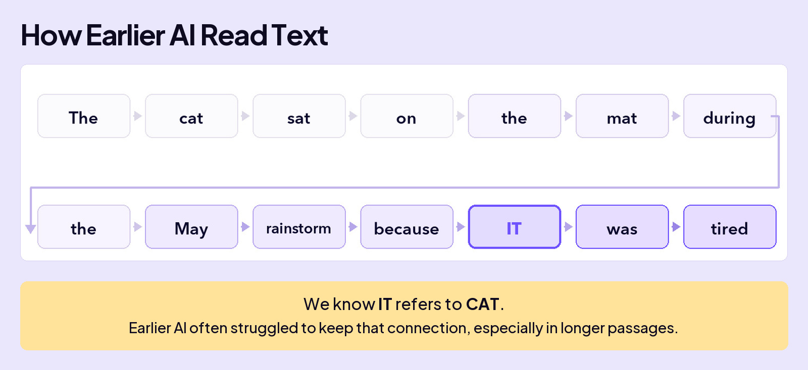
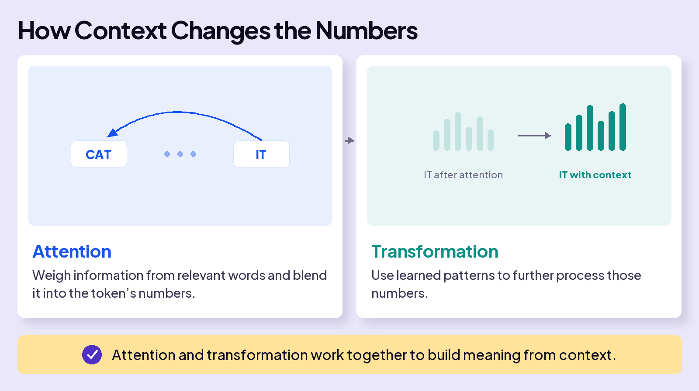

## UNDERSTAND AI

# Transformer

When you type a message to ChatGPT, you type real words and it responds the same way. You’ve already learned what happens underneath: AI turns your text into tokens, and each token’s vector carries its meaning. If only it were that easy.

Here are two nuances in language that break this idea. In both, the word’s meaning isn’t clear until you read the words around it.

## WHY THIS WAS HARD FOR AI

Our human brains see the right meaning instantly from the surrounding words. For AI, this was the big challenge, because of how it used to read text: in order, one word at a time. The further it read, the more the early words faded. Try it yourself with the sentence below. What does **IT** point to: cat, mat, May, or the rainstorm?

We instantly know **IT** points back to **CAT**, even ten words later. A computer reading strictly in order doesn’t, and that’s what kept old AI from reading like we do.

## THE BREAKTHROUGH

In 2017, eight researchers at Google published a paper called **Attention Is All You Need**. It introduced the **Transformer**, the architecture behind every modern LLM, and the “T” in ChatGPT. We’ll share the specific concepts next, but for now, let’s focus on the impact.

Instead of reading information sequentially, one word (token) at a time, the Transformer reads your whole message at once. That means it can establish the meaning of the word **IT** based on the words around it, like **CAT**, no matter how far apart they sit. And, it sees that the **CAT** is **TIRED**.

One question this raises: if all the words arrive at once, how does the model keep them in order? Hold that thought. The answer comes at the end of the lesson.

Reading your whole message at once was only the start. To turn reading into meaning, AI has to do two things. First, figure out which other words matter. For **IT**, the words that matter are **CAT** and **TIRED**. Second, update **IT**’s vector to lock in the right meaning: the cat, not the mat, May, or the rainstorm.

Here are the two steps:

Now let’s answer the two questions we left open.

And it goes beyond these examples. Sarcasm, idioms, even an “it” that points to nothing at all (“it was a cold day”): every nuance in language gets resolved the same way, by weighing all the words around it. That’s why eight researchers dared to put such a bold claim in their title. **Attention is all you need.**

## One catch: word order

One promise left to keep: the order question. Reading everything at once creates a problem that reading in order never had. Consider a simple sentence: “Dog bites man.” Same three tokens. Same three vectors. But the order carries the meaning.

The fix happens before the first layer. Every token’s vector gets a **position stamp**: a second pattern of numbers mixed in that says “I’m token #1,” “I’m token #3.” Now the sentence can arrive all at once without losing its order. The proper name for the stamp is **positional encoding**.

Attention is all you need.

Every nuance resolved by weighing the words around it.
