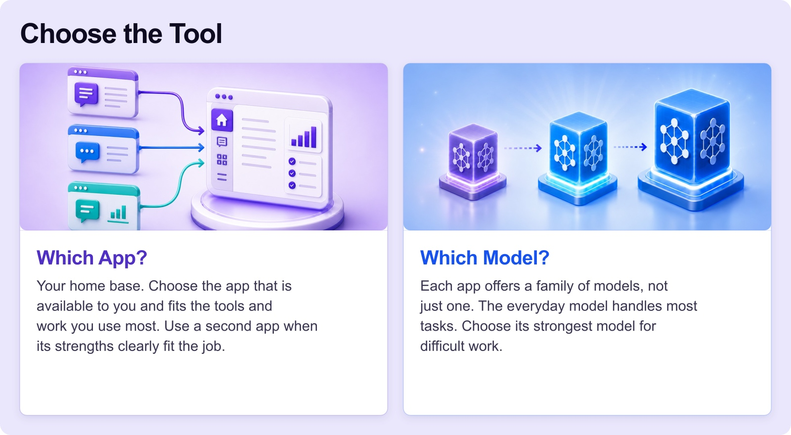
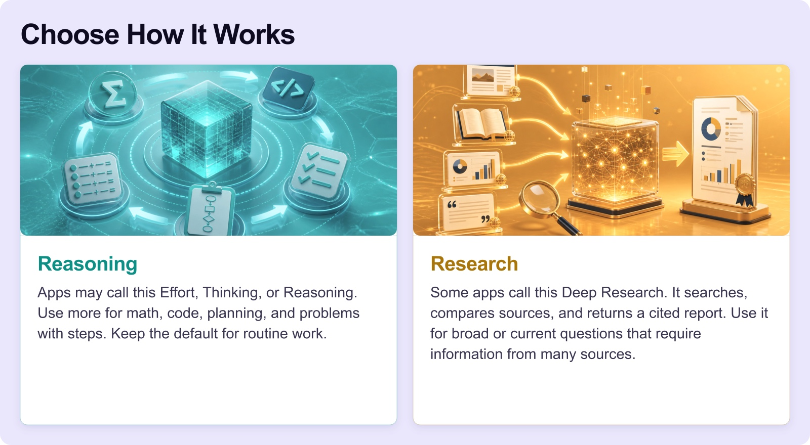
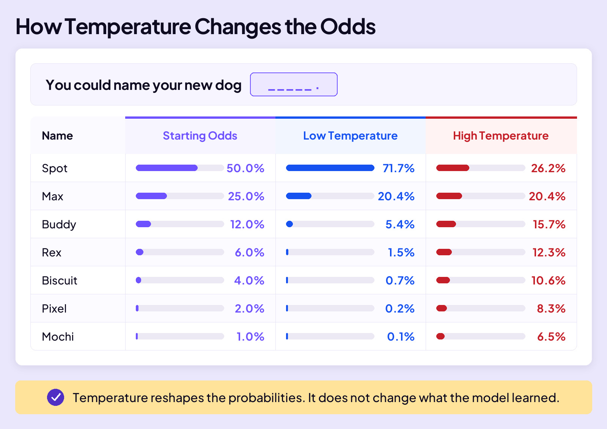

## BUILD YOUR SKILLS

# Your Choices

Choosing a music app is simple. You pick Spotify, Apple Music, or something else, then start listening.

Using AI starts the same way: you pick an app such as ChatGPT or Gemini. But depending on the app and your subscription, you may also be able to choose the model, how much reasoning it uses, and whether it performs deeper research.

You won’t make all four choices every time. The default handles most jobs. But when the work is harder or more important, knowing the choices lets you change the right thing.

## AGE RULES MATTER

If you’re under 18, check an app’s age requirements before using it. As of August 2026, ChatGPT requires parental permission for users ages 13–17, Gemini permits many teen accounts but limits some features, and Claude requires users to be 18.

## YOUR CHOICES

Your first choice is the app. The other three choices may or may not appear, depending on the app and your subscription. You do not need to see every choice. You need to understand what each one does when it appears.

### Which App

Choose an available home-base app that fits your tools and work. Use a second app when its strengths fit the job.

### Which Model

Each app offers a family of models. Use the everyday model for most tasks and its strongest model for difficult work.

### Reasoning

Apps may call this Effort, Thinking, or Reasoning. Use more for math, code, planning, and problems with steps. Keep the default for routine work.

### Research

Some apps call this Deep Research. It searches, compares sources, and returns a cited report. Use it for broad or current questions that require information from many sources.

## TEMPERATURE

AI companies control temperature behind the scenes, and you will likely never see or change it. Think of temperature as a variety switch. Low temperature makes answers more predictable. High temperature makes them more varied or surprising.

During training, AI learns patterns it uses to predict the next token. Each possible token gets a probability. Temperature reshapes those probabilities before AI chooses one. Low temperature makes the most likely choices even more likely. High temperature gives less likely choices a better chance.

For the unfinished sentence “You could name your new dog _____,” the starting odds favor Spot. Low temperature concentrates the odds on the most likely choices. High temperature spreads the odds and gives less likely names a better chance.

**Temperature reshapes the probabilities. It does not change what the model learned.**

## CLOSING MESSAGE

### The choices you make shape the answer.

The default usually works. Change it when the work demands more.

## LAB 13

# Map the Choices Behind an Answer

Use the free teen version of ChatGPT to see which decisions you make and which decisions ChatGPT makes for you. Not seeing a choice does not mean it disappeared. It means ChatGPT made the choice for you.

### 1. Open ChatGPT

Go to chatgpt.com and sign in with the free account you set up in Lab 01.

### 2. Start a new chat

Start a new chat outside any project.

### 3. Ask for one practical plan

Send this prompt. ChatGPT will make the hidden choices while it builds the answer.

> Help me plan a low-cost Saturday afternoon with two friends. Give me one safe, practical plan.

### 4. Inspect the interface

Look at the top of the chat and around the message box. The free teen experience does not show separate controls for Model, Reasoning, or Deep Research.

### 5. Notice who made each choice

For the answer you just received:

- **App:** You chose ChatGPT.
- **Model:** ChatGPT chose it.
- **Reasoning:** ChatGPT handled it.
- **Research:** Unavailable in this version.
- **Temperature:** OpenAI set it behind the scenes.

### 6. Ask for more variety

Send this follow-up, then compare it with the first answer. You changed the request, but the model and temperature controls stayed hidden.

> Now give me five very different plans, including ideas I might not expect.
