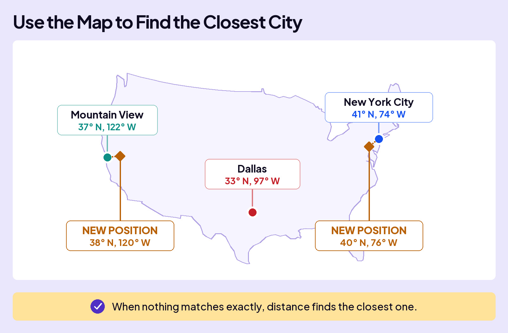
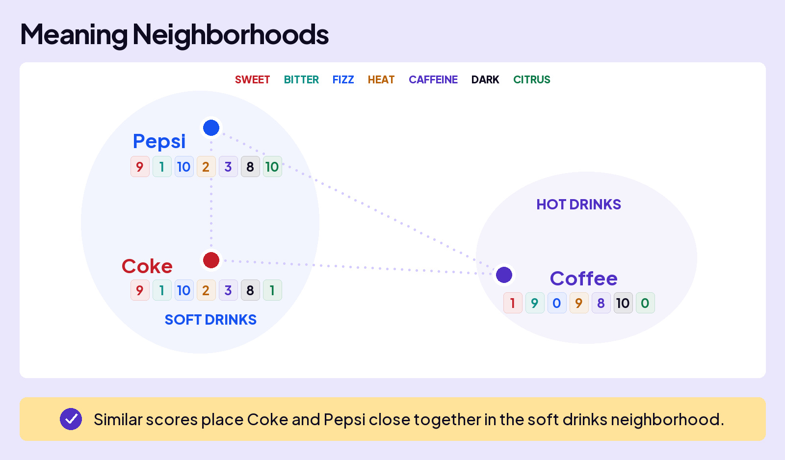
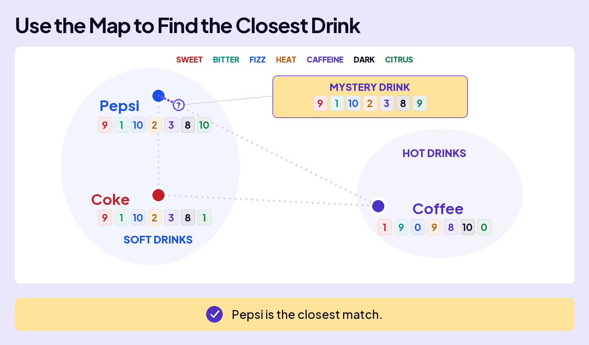

## UNDERSTAND AI

# Vector Space

AI represents meaning with rows of numbers called **embeddings**. As AI processes your message, the layers change the numbers. If the numbers are different, how do they still represent meaning? To understand how, let’s explore **vector space**.

## Let’s Start With a Map

A map uses two numbers to describe position: latitude and longitude. Dallas, Texas, is roughly 33° north, 97° west. New York City and Mountain View, California, have their own coordinates, using those same two dimensions.

Imagine these are the only three cities on our map.

### Board 1: Three Cities, Two Coordinates Each

**Image file:** `vector-space-1-cities.jpg`

**Teaching content:**

Each city has a position described by latitude and longitude. These are approximate coordinates:

| City | Latitude | Longitude |
| --- | --- | --- |
| Mountain View | 37° N | 122° W |
| Dallas | 33° N | 97° W |
| New York City | 41° N | 74° W |

**Takeaway:** Latitude and longitude give each city a position.

Someone hands you two sets of coordinates. For each position, which of the three cities is closest?

- **38 N, 120 W**
- **40 N, 76 W**

### Board 2: Use the Map to Find the Closest City

**Image file:** `vector-space-1-cities-closest.jpg`

**Teaching content:**

Keep the same three cities on the map:

| City | Latitude | Longitude |
| --- | --- | --- |
| Mountain View | 37° N | 122° W |
| Dallas | 33° N | 97° W |
| New York City | 41° N | 74° W |

Add two new positions:

| New position | Closest of these three cities |
| --- | --- |
| 38° N, 120° W | Mountain View |
| 40° N, 76° W | New York City |

Neither position exactly matches a city. Comparing their positions still identifies the closest of the three.

**Takeaway:** When nothing matches exactly, distance finds the closest one.

The new coordinates don’t match any city exactly. But comparing positions finds the closest city: 38° N, 120° W is closest to Mountain View, and 40° N, 76° W is closest to New York City.

## From Places to Meaning

These ratings for Coke, Pepsi, and coffee describe seven characteristics. Each drink gets a row of numbers called a **vector**.

### Board 3: Three Drinks, Seven Dimensions Each

**Image file:** `vector-space-2-taste.jpg`

**Teaching content:**

Each drink has seven ratings on a scale from 0 to 10. Compare matching columns:

| Drink | Sweet | Bitter | Fizz | Heat | Caffeine | Dark | Citrus |
| --- | --- | --- | --- | --- | --- | --- | --- |
| Coke | 9 | 1 | 10 | 2 | 3 | 8 | 1 |
| Pepsi | 9 | 1 | 10 | 2 | 3 | 8 | 10 |
| Coffee | 1 | 9 | 0 | 9 | 8 | 10 | 0 |

**Takeaway:** Coke and Pepsi have more similar profiles than either does to coffee.

Just as latitude and longitude give a city a position, a drink’s seven ratings give it a position in a space with seven dimensions. That’s **vector space**. We can picture the similarities on a map: Coke and Pepsi sit close together, while coffee sits farther away.

### Board 4: A Map of Drink Similarities

**Image file:** `vector-space-neighborhoods.jpg`

**Teaching content:**

The map pictures the similarities between these numerical profiles:

| Drink | Sweet | Bitter | Fizz | Heat | Caffeine | Dark | Citrus |
| --- | --- | --- | --- | --- | --- | --- | --- |
| Coke | 9 | 1 | 10 | 2 | 3 | 8 | 1 |
| Pepsi | 9 | 1 | 10 | 2 | 3 | 8 | 10 |
| Coffee | 1 | 9 | 0 | 9 | 8 | 10 | 0 |

Coke and Pepsi sit near each other in the soft drinks neighborhood. Coffee sits farther away in the hot drinks neighborhood. Their positions express similarities and differences in the ratings.

**Takeaway:** Similar scores place Coke and Pepsi together in the soft drinks neighborhood.

Now someone gives you the ratings for a mystery drink. They don’t match Coke, Pepsi, or coffee exactly. Just as you did with the cities, use the map to find the closest match.

- **9, 1, 10, 2, 3, 8, 9**

### Board 5: Use the Map to Find the Closest Drink

**Image file:** `vector-space-closest-drink.jpg`

**Teaching content:**

The mystery drink’s ratings are **[9, 1, 10, 2, 3, 8, 9]**, in this order: Sweet, Bitter, Fizz, Heat, Caffeine, Dark, Citrus.

Its first six scores match Pepsi’s. Its Citrus score is 9 compared with Pepsi’s 10, a gap of just 1. Coke’s Citrus score is 1, a gap of 8. The mystery point therefore sits close to Pepsi on the map.

**Takeaway:** The mystery drink’s ratings are closest to Pepsi’s.

## Distance

The mystery drink’s first six scores match Pepsi’s. Only Citrus differs: 9 instead of 10, a gap of just 1. Compared with Coke, the Citrus gap is 8. So the mystery drink is closest to Pepsi.

This is the idea behind **distance**: compare the numbers in matching positions across the vectors. Smaller gaps mean closer positions.

AI uses this idea on a much larger scale. Its embeddings have thousands of dimensions. The values in those dimensions are learned during training. Similar meanings usually occupy nearby positions in vector space.

## When the Numbers Change

In AI, the layers change the numbers to reflect a word’s meaning in a specific sentence. Let’s see how this works in vector space:

**The sentence:** “The **CAT** sat on the mat during the May rainstorm because **IT** was tired.”

On its own, **IT** could refer to many things. As the layers process this sentence, they update **IT**’s numbers to carry information connecting it to **CAT**. Changing those numbers also changes its position in **vector space**.

### Board 6: How Context Changes IT’s Position

**Image file:** `vector-space-4-meaning-map.jpg`

**Teaching content:**

IT begins with numbers **[0.12, −0.34, …]**. As the layers update the numbers to **[0.41, 0.06, …]**, its position changes.

The path ends with a separate IT marker near CAT. The animal neighborhood also contains a dog, kitten, and pet bowl. Adjoining neighborhoods contain a mat and chair, and a cloud and rainstorm.

The movement illustrates IT’s contextual connection to CAT. It does not mean the model identifies a word’s meaning by looking up the nearest original token embedding.

**Takeaway:** IT’s new position reflects its connection to CAT in this sentence.

## Closing Message

Meaning is a position in vector space.

Similar meanings usually sit close together.
