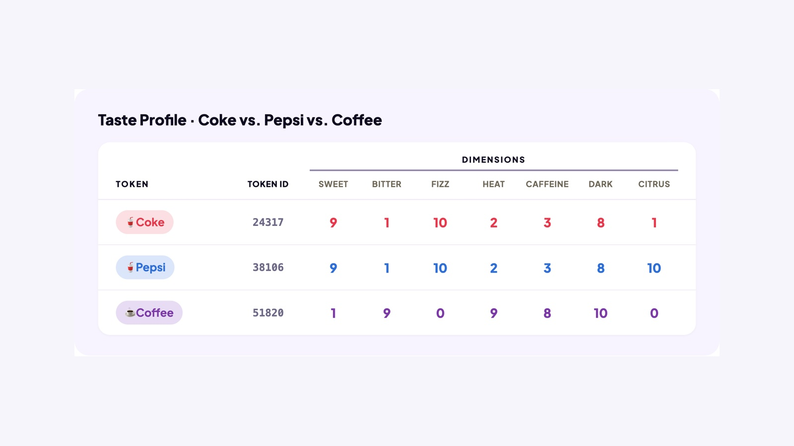

## UNDERSTAND AI

# Vector Space

AI represents meaning with rows of numbers called embeddings. As AI processes your message, the layers change the numbers. If the numbers are different, how do they still represent meaning? To understand how, let’s explore vector space.

## Let’s Start With a Map

A map uses two numbers to describe position: latitude and longitude. Dallas, Texas, is roughly 33° north, 97° west. New York City and Mountain View, California, have their own coordinates, using those same two dimensions.

Imagine these are the only three cities on our map.

### Board 1: Three Cities, Two Coordinates Each

**Image file:** `vector-space-cities.jpg`

**Teaching content:**

A United States map marks three cities, each with two approximate coordinates. Mountain View is at 37° north, 122° west. Dallas is at 33° north, 97° west. New York City is at 41° north, 74° west.

Latitude and longitude give each city a position.

Someone hands you two sets of coordinates. For each position, which of the three cities is closest? The first position is 38° north, 120° west. The second position is 40° north, 76° west.

The position 38° north, 120° west is closest to Mountain View. The position 40° north, 76° west is closest to New York City.

### Board 2: Use the Map to Find the Closest City

**Image file:** `vector-space-cities-closest.jpg`

**Teaching content:**

The same map keeps Mountain View, Dallas, and New York City in place. Two new positions are added: 38° north, 120° west, and 40° north, 76° west. A dotted line connects 38° north, 120° west to Mountain View, the nearest of the three cities. Another dotted line connects 40° north, 76° west to New York City, the nearest of the three cities.

When nothing matches exactly, distance finds the closest one.

The new coordinates don’t match any city exactly. But comparing positions lets you find the closest city.

## From Places to Meaning

These ratings for Coke, Pepsi, and coffee describe seven characteristics. Each drink gets a row of numbers called a vector.

### Board 3: Three Drinks, Seven Dimensions Each

**Image file:** `vector-space-taste.jpg`

**Teaching content:**

Each drink is rated on the same seven dimensions, in this order: Sweet, Bitter, Fizz, Heat, Caffeine, Dark, and Citrus. The ratings run from 0 to 10, where 0 is low and 10 is high.

Coke’s ratings are 9, 1, 10, 2, 3, 8, 1.

Pepsi’s ratings are 9, 1, 10, 2, 3, 8, 10.

Coffee’s ratings are 1, 9, 0, 9, 8, 10, 0.

Compare the columns. Coke and Pepsi match on the first six dimensions and differ only on Citrus, where Coke scores 1 and Pepsi scores 10. Coffee’s ratings differ from both on every one of the seven.

Coke and Pepsi have more similar profiles than either does to coffee.

Just as latitude and longitude give a city a position, a drink’s seven ratings give it a position in a space with seven dimensions. That’s vector space.

We can picture the similarities on a map: Coke and Pepsi sit close together, while coffee sits farther away.

### Board 4: A Map of Drink Similarities

**Image file:** `vector-space-neighborhoods.jpg`

**Teaching content:**

The map places Coke and Pepsi as nearby points inside the soft drinks neighborhood. Coffee sits farther from both, in the hot drinks neighborhood. Each drink shows its seven scores in the same order: Sweet, Bitter, Fizz, Heat, Caffeine, Dark, Citrus. Coke: 9, 1, 10, 2, 3, 8, 1. Pepsi: 9, 1, 10, 2, 3, 8, 10. Coffee: 1, 9, 0, 9, 8, 10, 0. Dotted lines compare the gaps between positions: the line between Coke and Pepsi is short, and the lines from each of them to coffee are long. The positions picture how similar or different the ratings are.

Similar scores place Coke and Pepsi close together in the soft drinks neighborhood.

Now someone gives you the ratings for a mystery drink. They don’t match Coke, Pepsi, or coffee exactly. Just as you did with the cities, use the map to find the closest match. The mystery drink’s ratings are 9, 1, 10, 2, 3, 8, 9. Its closest match is Pepsi.

### Board 5: Use the Map to Find the Closest Drink

**Image file:** `vector-space-closest-drink.jpg`

**Teaching content:**

The same map keeps Coke, Pepsi, coffee, and their scores in place. A new mystery point with ratings 9, 1, 10, 2, 3, 8, 9 sits close to Pepsi, joined by a short dotted line. Its first six scores match Pepsi’s. Its Citrus score is 9, compared with Pepsi’s 10.

The mystery drink’s ratings are closest to Pepsi’s.

## Distance

The mystery drink’s first six scores match Pepsi’s. Only Citrus differs: 9 instead of 10, a gap of just 1. Compared with Coke, the Citrus gap is 8. That puts the mystery drink closer to Pepsi.

This is the idea behind distance: compare the numbers in matching positions across the vectors.

Smaller gaps mean closer positions.

AI uses this idea on a much larger scale. Its embeddings have thousands of dimensions, with values learned during training. Similar meanings usually occupy nearby positions in vector space.

## When the Numbers Change

In AI, the layers change the numbers to reflect a word’s meaning in a specific sentence. Let’s see how this works in vector space.

The sentence: “The CAT sat on the mat during the May rainstorm because IT was tired.”

On its own, IT could refer to many things. As the layers process this sentence, they update IT’s numbers to carry information connecting it to CAT. Changing those numbers also changes its position in vector space.

### Board 6: How Context Changes IT’s Position

**Image file:** `vector-space-meaning-map.jpg`

**Teaching content:**

A tabletop meaning map has three neighborhoods. The objects neighborhood holds a mat and a chair. The weather neighborhood holds a cloud and a rainstorm. The animals neighborhood holds a cat, a dog, a kitten, and a pet bowl. The mat and the rainstorm are also in the sentence, so on its own IT might have pointed to either of them.

A blue IT marker begins outside the neighborhoods at its starting position, with numbers .12, −.34, and so on. A path labeled “The layers update the numbers” leads through three intermediate points. IT ends at its updated position, with numbers .41, .06, and so on, right next to CAT inside the animals neighborhood. The move pictures how changing the numbers changed IT’s position.

IT’s new position reflects its connection to CAT in this sentence.

## Closing Message

Meaning is a position in vector space.

Similar meanings usually sit close together.
