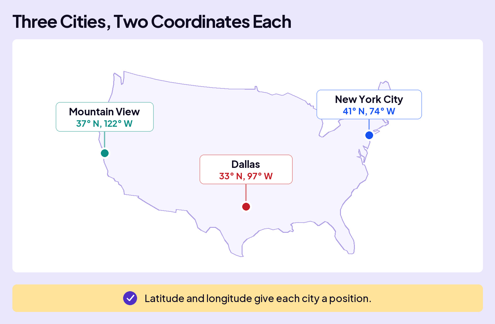
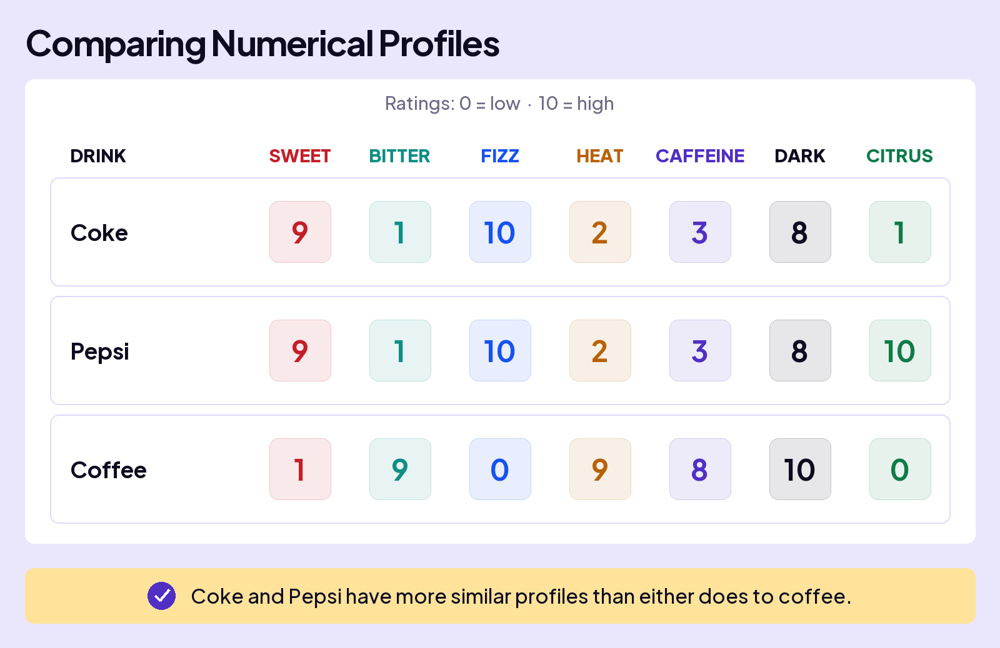
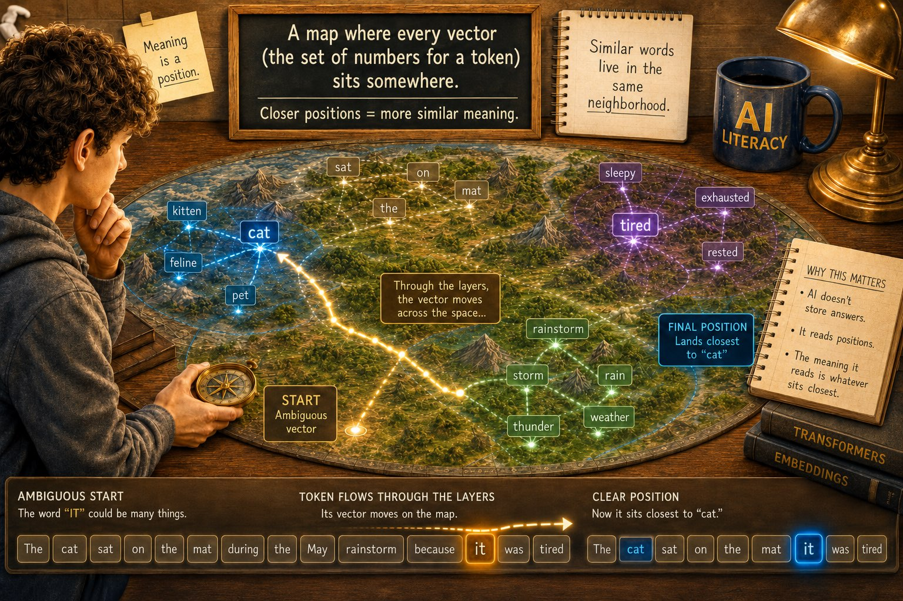

## UNDERSTAND AI

# Vector Space

As a token moves through the layers, its numbers change at every step. In theory, AI could look up those finished numbers in its full table of token embeddings and see which token they match. **But it can’t: the transformed numbers are one of a kind, lining up with no token in the table.**

So how does AI work out what the token means, when its vector matches nothing on file? It finds the closest match. That sounds simple, but there’s more to it.

## AI uses a map (kind of)

A regular map works like this. You can find any place by knowing two things: the latitude and the longitude. Want to find Dallas, Texas? Just give it a north latitude of 33 and a west longitude of 97.

Can we add New York City and Mountain View, California? Yep. They track the same dimensions.

Now, let’s pretend those are the only three cities in the United States. Your job is simple. You get the coordinates and have to match them to the closest city.

- **38 N, 120 W**? That’s right. The closest match is Mountain View.
- **39 N, 70 W**? Of course, New York City.
You did exactly what AI does. There was no match for the numbers, so you found the closest match.

## AI is way more complicated

You’ve learned there are many more dimensions than two. But the core idea is the same: it establishes meaning based on distance.

This is how you learned a token’s meaning with numbers: a taste profile of Coke vs. Pepsi vs. Coffee.

Coke and Pepsi’s vectors (their rows of numbers) sit much closer to each other than either does to Coffee. If this was a map, it might look like this.

## Sweet · Bitter · Fizz · Heat · Caffeine · Dark · Citrus

## Soft drinks neighborhood

SWE

BIT

FIZ

HEA

CAF

DAR

CIT

🥤Coke

9

1

10

2

3

8

1

🥤Pepsi

9

1

10

2

3

8

10

## Sports and energy neighborhood

Gatorade

Powerade

## Juices neighborhood

lemonade

orange juice

## Hot drinks neighborhood

☕Coffee

espresso

On the map, Coke and Pepsi sit side by side in the Soft drinks neighborhood. Coffee is all the way across, in the Hot drinks neighborhood.

Let’s try the same exercise you used on a real map. Here are coordinates you need to match to a drink. Those numbers don’t exist on the table, so you need to figure out which drink these numbers mean.

- **9, 1, 10, 2, 3, 8, 9**? A fizz of 10 puts it with the sodas, and a citrus of 9 puts it right beside Pepsi. It doesn’t match anything on file exactly, and it doesn’t have to. You know it refers to Pepsi.

## Distance

Here’s what you just did. Add up the gap between two sets of numbers across every dimension, and you get their **distance**. That is how AI measures closeness.

Of course, AI does it on a massive scale. Every token carries thousands of dimensions, not seven, and AI learned every one of those values during training. And just like on our maps, tokens that mean similar things sit close together, so landing near a token is not a near miss. It is how the meaning gets read.

## Meaning is a position

Back to that one-of-a-kind token. AI can’t look its numbers up, but it can do what we just did with the drinks: read the token’s **position** on a map where similar meanings sit close together. That’s **vector space**.

Now, back to our sentence from the last lesson.

Meaning is a position.

Close in space is close in meaning.
