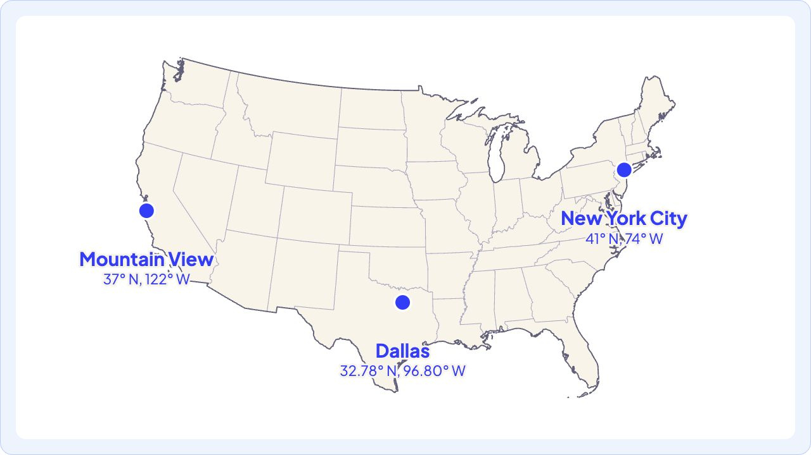
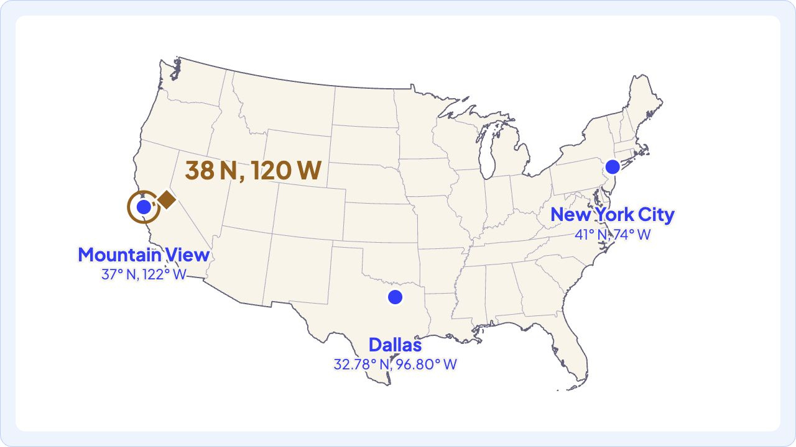
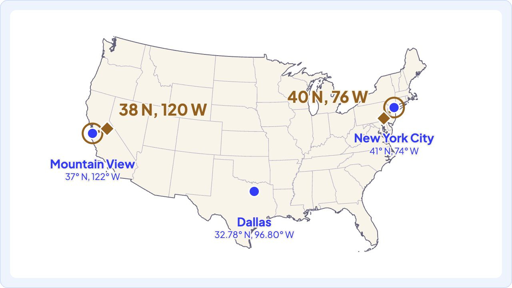
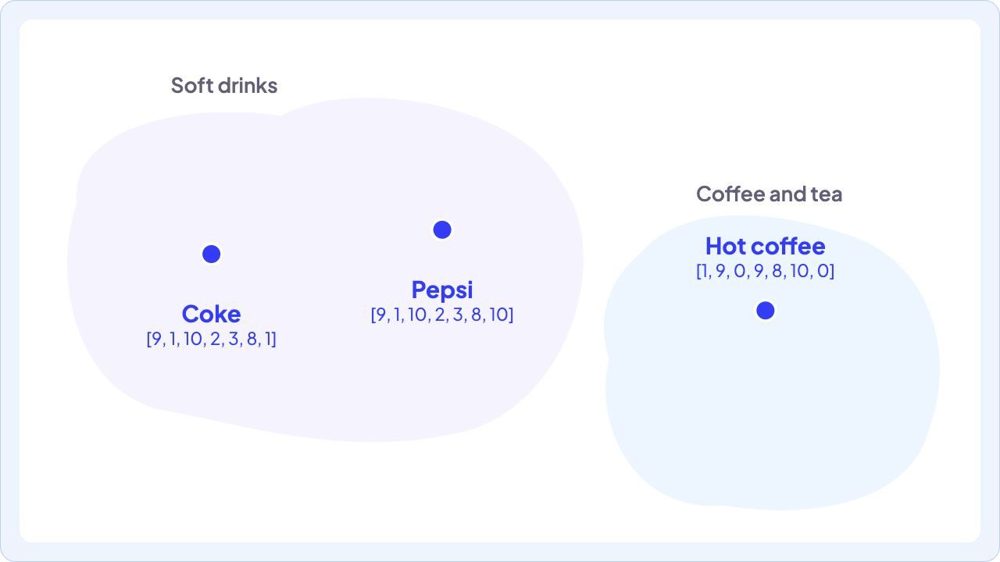
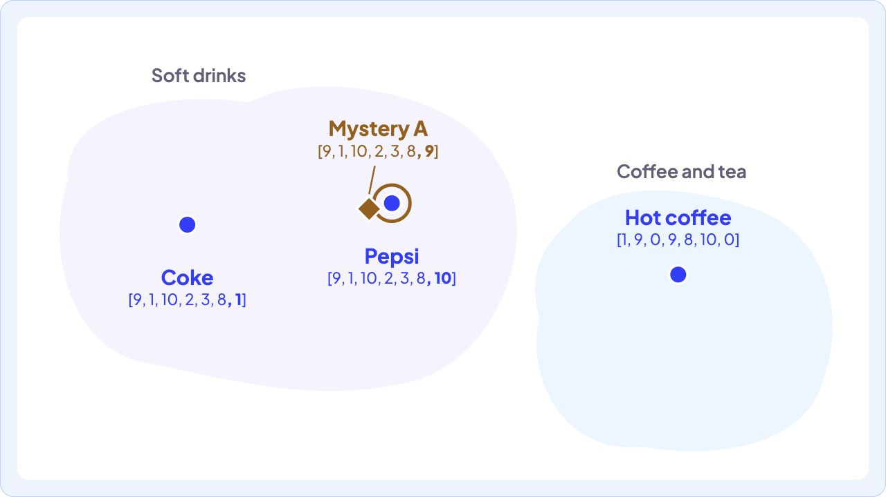
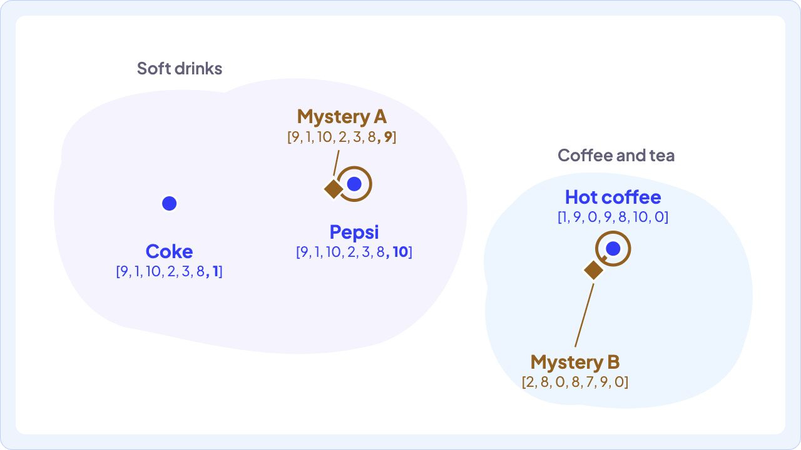
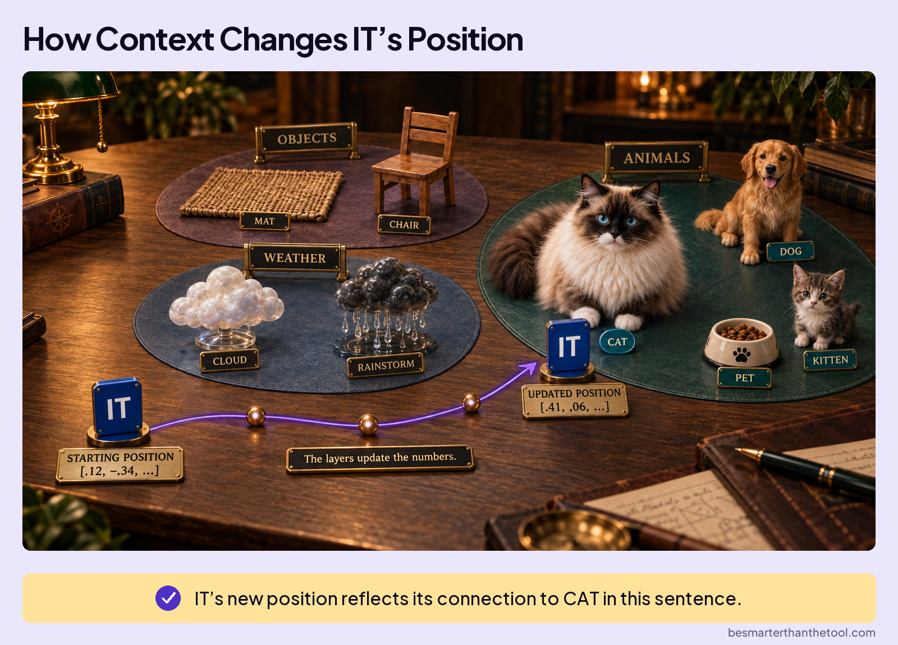

## UNDERSTAND AI

# Vector Space

Each token starts with a row of numbers called an embedding. As AI processes your message, the layers change those numbers to reflect the context.

But those new numbers might not match the starting numbers for any token.

How can they still represent meaning?

An exact match isn’t necessary.

The relationships between the numbers matter too.

We can picture those relationships as positions on a map, where nearby positions can represent similar meanings.

That’s the idea behind vector space.

## Let’s Start With a Map

A map uses two numbers to describe position: latitude and longitude. Imagine a map with only three cities. Follow along as we add new positions and use distance to find the closest city.

### Board 1: Three Cities

**Image file:** `vector-space-cities-established.jpg`

**Teaching content:**

Let’s add Dallas to the map. Dallas has the coordinates 32.78 degrees north, 96.80 degrees west.

Next, add Mountain View at 37 degrees north, 122 degrees west.

Then add New York City at 41 degrees north, 74 degrees west.

## New Coordinates

Now you get coordinates that don’t match one of our existing cities. Your goal is to find the closest city.

### Board 2: The First New Position

**Image file:** `vector-space-cities-mystery-a-match.jpg`

**Teaching content:**

The first is 38 degrees north, 120 degrees west. Let’s add that position to the map.

The diamond marks the new position. Which of our three cities is closest?

Mountain View is closest, even without an exact match. The short connection joins the diamond to Mountain View, and the ring marks that city.

### Board 3: The Second New Position

**Image file:** `vector-space-cities-mystery-b-match.jpg`

**Teaching content:**

Next, try 40 degrees north, 76 degrees west. Let’s add this second diamond. Which city is closest?

New York City is closest to the second point. The new connection and ring identify that match.

The coordinates didn’t match either city exactly, but distance helped us find the closest match.

## From Places to Meaning

A map uses two numbers to describe a position. Comparing positions helps us find the closest match. We can do the same with more than two numbers.

Imagine a taste test where you rate Coke, Pepsi, and hot coffee on seven characteristics. Each drink gets seven numbers, called a vector. Think of those numbers as coordinates that place the drink on a map.

We can’t draw all seven dimensions, but a simplified picture shows which drinks are closest.

### Board 4: Three Drinks

**Image file:** `vector-space-drinks-established.jpg`

**Teaching content:**

Let’s add Coke to the map. Its coordinates are sweetness 9, bitterness 1, fizz 10, heat 2, caffeine 3, darkness 8, and citrus 1.

Next, add Pepsi. Its coordinates are sweetness 9, bitterness 1, fizz 10, heat 2, caffeine 3, darkness 8, and citrus 10.

Pepsi’s scores are close to Coke’s, so it sits near Coke in the Soft drinks neighborhood.

Now add hot coffee. Its coordinates are sweetness 1, bitterness 9, fizz 0, heat 9, caffeine 8, darkness 10, and citrus 0.

Hot coffee’s scores differ more from Coke’s and Pepsi’s, so it sits farther away in the Coffee and tea neighborhood.

## Mystery Drinks

Now you get numbers that don’t match any of our existing drinks. Your goal is to find the closest drink.

### Board 5: Mystery Drink A

**Image file:** `vector-space-drinks-mystery-a-match.jpg`

**Teaching content:**

Let’s add Mystery Drink A. Its coordinates are sweetness 9, bitterness 1, fizz 10, heat 2, caffeine 3, darkness 8, and citrus 9.

Mystery Drink A is near Coke and Pepsi. Its first six numbers match both. Compare the last number, citrus: Mystery Drink A is 9, Coke is 1, and Pepsi is 10. Which is closest?

Pepsi is closest: the citrus gap is only 1, compared with 8 for Coke. The short connection and ring identify Pepsi.

### Board 6: Mystery Drink B

**Image file:** `vector-space-drinks-mystery-b-match.jpg`

**Teaching content:**

Now add Mystery Drink B. Its coordinates are sweetness 2, bitterness 8, fizz 0, heat 8, caffeine 7, darkness 9, and citrus 0.

Mystery Drink B is in the Coffee and tea neighborhood. Compare its seven numbers with hot coffee’s vector. Which drink is the closest match?

Hot coffee is closest to Mystery Drink B. Its ratings are similar across all seven dimensions. The new connection and ring identify hot coffee.

Each drink’s seven numbers give it a position in vector space. Comparing those numbers helps us find the closest match.

## Distance

Neither Mystery Drink had an exact match. But by comparing numbers across all dimensions, you found the closest match.

This is the idea behind distance: smaller gaps mean closer positions.

AI uses this idea on a much larger scale.

Its embeddings have thousands of dimensions, with values learned during training.

We can’t picture a map with thousands of dimensions, but the core idea is the same.

After the layers update a token’s vector, it doesn’t need to match another vector exactly.

Its position in vector space helps represent its meaning.

## When the Numbers Change

In AI, the layers change the numbers to reflect a word’s meaning in a specific sentence. Let’s see how this works in vector space.

“The CAT sat on the mat during the May rainstorm because IT was tired.”

On its own, IT could refer to many things. As the layers process this sentence, they update IT’s numbers to carry information connecting it to CAT. Changing those numbers also changes its position in vector space.

### Board 7: How Context Changes IT’s Position

**Image file:** `vector-space-meaning-map.jpg`

**Teaching content:**

Here’s how context changes IT’s position. The map groups objects such as a mat and chair, weather such as a cloud and rainstorm, and animals such as a cat, dog, and kitten, with a pet bowl nearby.

IT’s starting position has numbers beginning 0.12, minus 0.34. The layers update the numbers. Follow the path to IT’s updated position, with numbers beginning 0.41, 0.06.

IT remains a separate token, now near CAT.

IT’s new position reflects its connection to CAT in this sentence.

## Closing Message

Meaning is a position in vector space.

Similar meanings usually sit close together.
