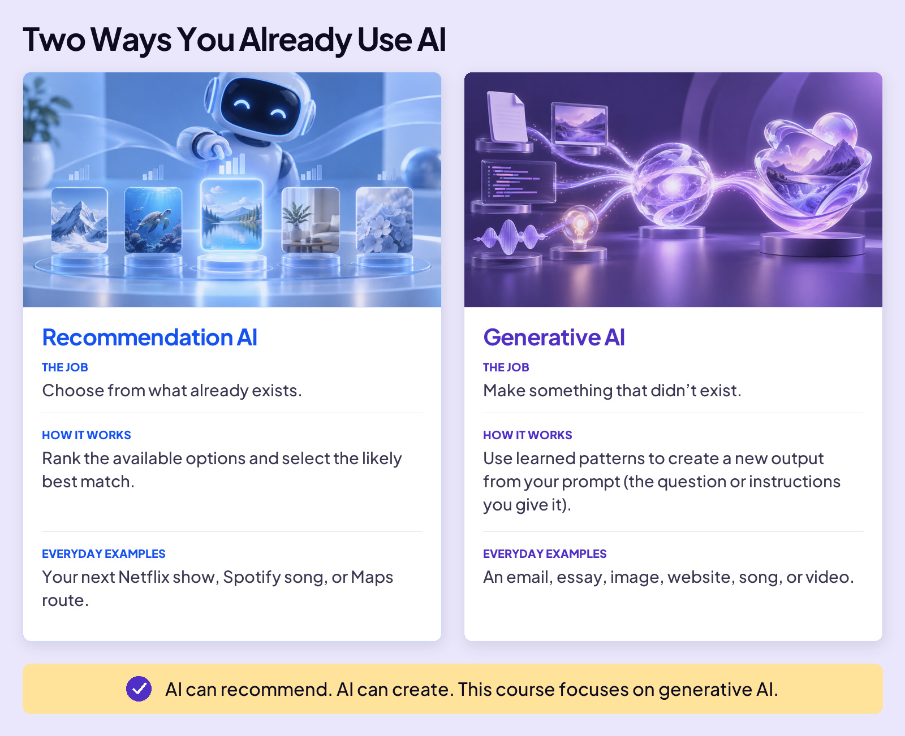
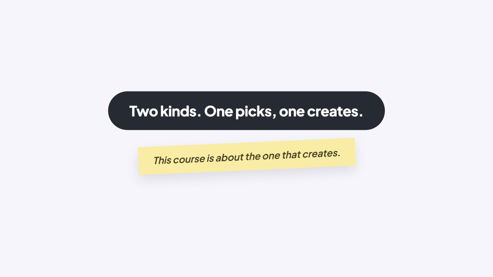

## START SMARTER

# What Is AI?

Ask your desk at school, “Give me 10 ideas for my next history project.”

Nothing. It’s a desk.

Ask a friend, and they can help you brainstorm. Ask AI, and it can give you a list in seconds.

### Board 1: Ask the Desk. Ask AI.

**Image file:** `what-is-ai-ask-the-desk.jpg`

**Teaching content:**

Luke asks an ordinary school desk for 10 history-project ideas and gets no response. Nate asks AI on a laptop and gets a numbered list of ten ideas, from Ancient Egypt to the Berlin Wall. AI is software built to do things that used to take a human brain.

AI is software built to do things that used to take a human brain. Understand a question. Summarize information. Translate a conversation. Suggest ideas for a history project.

That doesn’t mean it thinks like your friend, or that all 10 ideas will be good. But you now have a tool that can help with tasks that once needed a person.

Different AI systems do different jobs. Let’s look at two kinds you already use.

### Board 2: Two Ways You Already Use AI

**Image file:** `what-is-ai-1-types.jpg`

**Teaching content:**

Recommendation AI. The job: choose from what already exists. How it works: rank the available options and select the likely best match. Everyday examples: your next Netflix show, Spotify song, or Maps route.

Generative AI. The job: make something that didn’t exist. How it works: use learned patterns to create a new output from your prompt, which is the question or instructions you give it. Everyday examples: an email, essay, image, website, song, or video.

AI can recommend. AI can create. This course focuses on generative AI.

Here’s what that difference looks like.

### Board 3: One Picks. One Creates.

**Image file:** `what-is-ai-2-same-goal.jpg`

**Teaching content:**

The scenario: you’re in the mood for superheroes.

Recommendation AI picks. It chooses from what already exists. The job: find a superhero movie you might enjoy. What you get: Captain America: Civil War, a movie selected from an existing catalog based on your interests. It picked a movie that already exists.

Generative AI creates. It creates something new from your request. The job: write a scene about two superhero teammates who disagree. What you get: “We save the bridge,” Maya said. “The hospital loses power in three minutes,” Leo replied. “We can’t do both.” It generated a scene from your request.

One helps you find something to watch. The other helps you create a story of your own.

### Close

**Image file:** `what-is-ai-4-close.jpg`

## Closing Message

Two kinds. One picks, one creates.

This course is about the one that creates.
