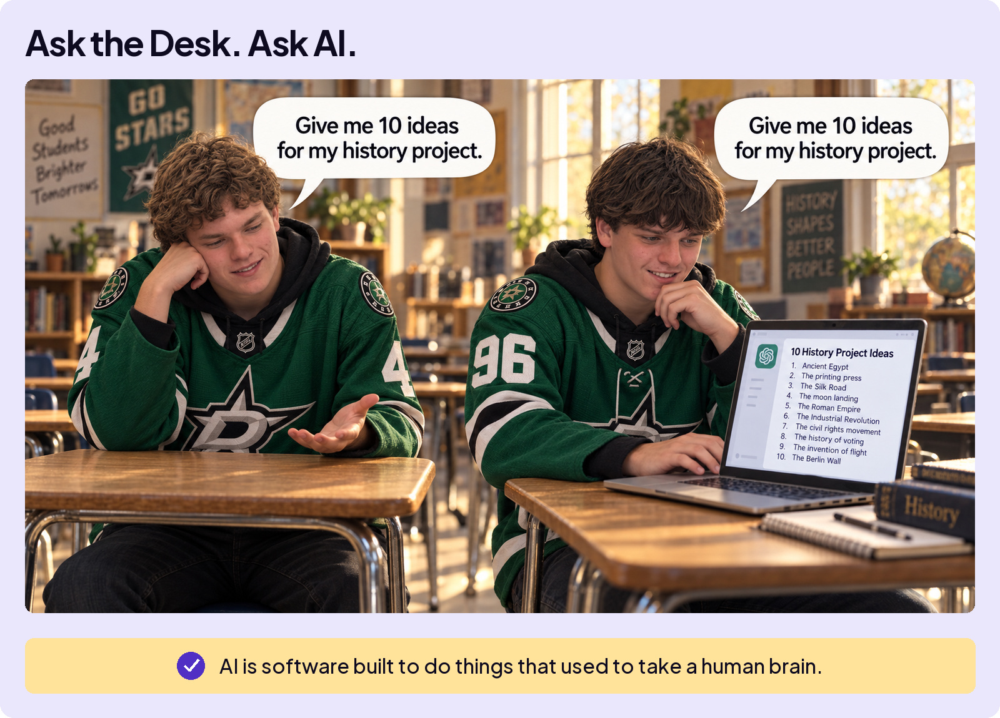
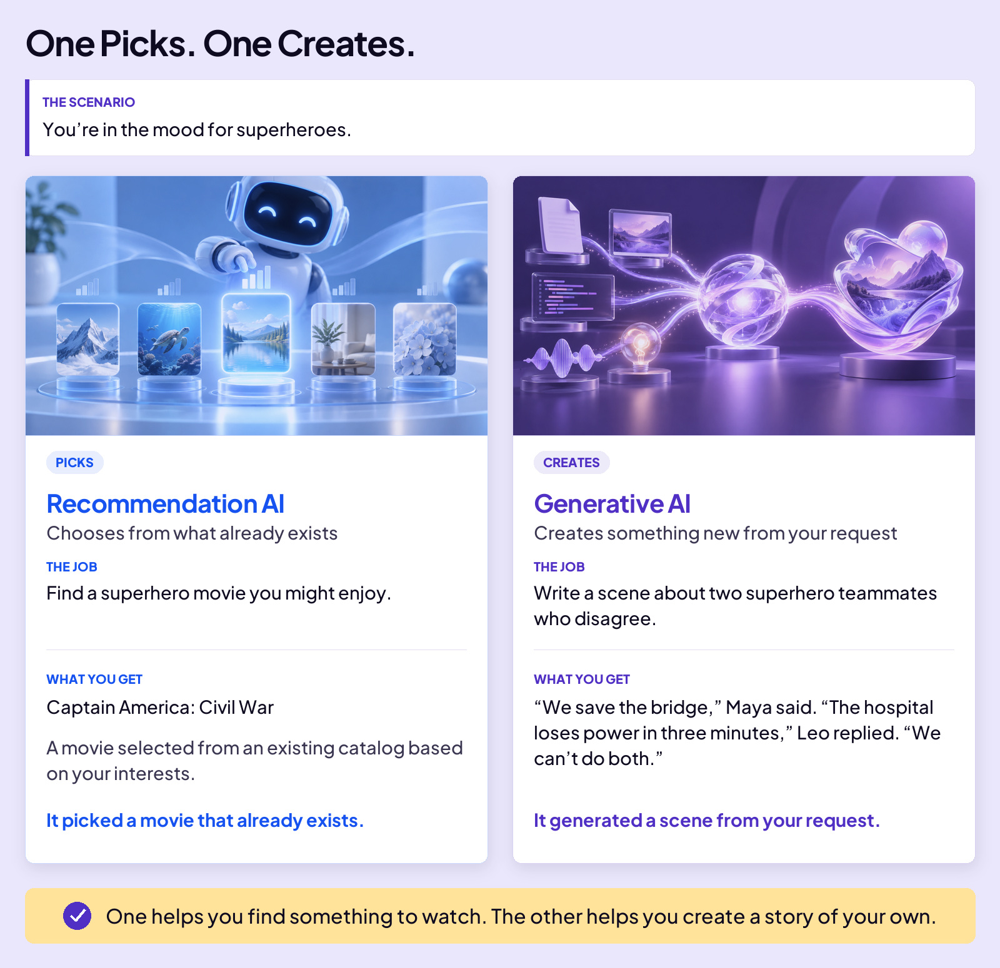

## START SMARTER

# What Is AI?

Ask your desk at school, “Give me 10 ideas for my next history project.”

Nothing. It’s a desk.

Ask a friend, and they can help you brainstorm. Ask AI, and it can give you a list in seconds.

**AI is software built to do things that used to take a human brain.** Understand a question. Summarize information. Translate a conversation. Suggest ideas for a history project.

That doesn’t mean it thinks like your friend, or that all 10 ideas will be good. But you now have a tool that can help with tasks that once needed a person.

Different AI systems do different jobs. Let’s look at two kinds you already use.

Here’s what that difference looks like.

Two kinds. One picks, one creates.

This course is about the one that creates.
