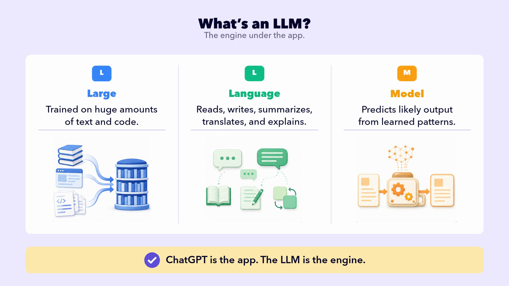

## START SMARTER

# What Is AI?

You hear about AI constantly. So what is it, really? The useful starting point: AI is software built to do things that used to take a human brain. And it comes in two kinds.

Types of AI

(and you already use both)

🔀Sorts & recommends

Recommendation AI

Chooses from what already exists

✓

✓

✓

✓

✓

Ranks the options and picks the top one

## Where you meet it

Next show on Netflix

Next song on Spotify

Fastest route on Maps

Never makes anything new.

✨Creates new content

Generative AI

Makes something that didn’t exist

Twin boys in high school, who love the Dallas Stars, are building an AI course at a warm kitchen table.

This prompt made the picture on the welcome page.

## What it can do

Writes the email

Drafts the essay

Makes the image

Codes the website

Creates the song

Builds the video

When people picture AI, they usually mean this, and it’s what this course is about.

Here’s what that difference looks like on one task.

THE TASK

“What movie should I watch tonight?”

📺

#### Recommendation AI

Netflix-style recommendation

Midnight Harbor

seen

Echoes of the Tide

TOP PICK

The Glass Orchard

Northern Lights

It just moves to the next title on the list. It has no idea why you skipped the first.

✨

#### Generative AI

Writes a reply, in a conversation

How about Midnight Harbor? It’s the slow-burn thriller most people rate highest right now, rainy and tense the whole way through.

Composes a reply, and you can talk back.

🛋️ I already saw that at a friend’s.

Ah, then skip it. Try Paper Cranes instead, it keeps that same rainy, tense mood but it’s a quiet little mystery you’ve almost certainly missed. Want something lighter?

Recommendation AI just slid to the next title on its list. Generative AI took your situation, that you’d already seen it, and composed something new from it. And it’s still in the conversation.

## THE NAME GAME

You’ll hear a pile of names: AI, generative AI, ChatGPT, LLM. Don’t let the terminology trip you up. For the rest of this course, we’ll usually say AI, and we mean the generative kind that you experience with ChatGPT, Claude, and Gemini.

There’s a name for these generative AI tools: LLM, short for **Large Language Model**. Think of it like this. ChatGPT is the app you use, and the LLM is the engine under the hood doing the work.

Two kinds. One picks, one makes.

This course is about the one that makes.
