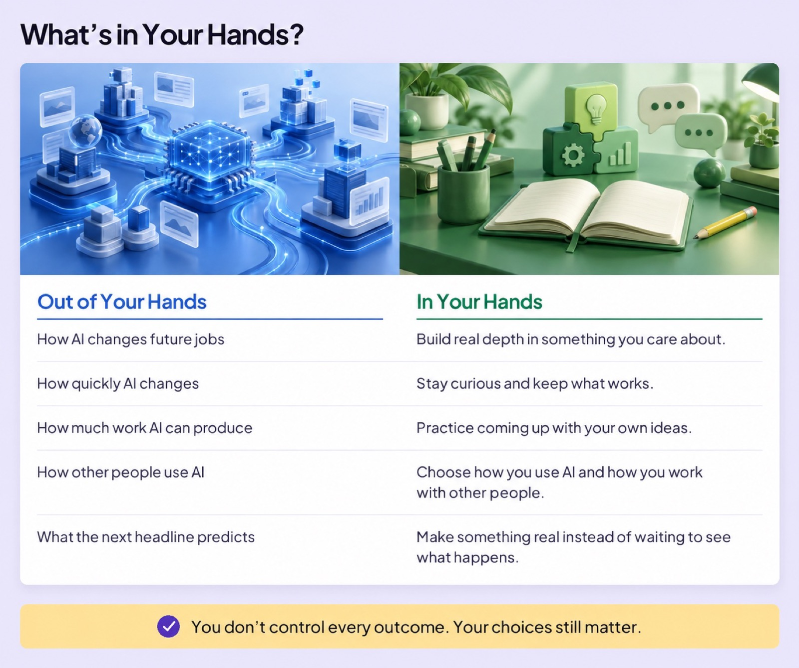
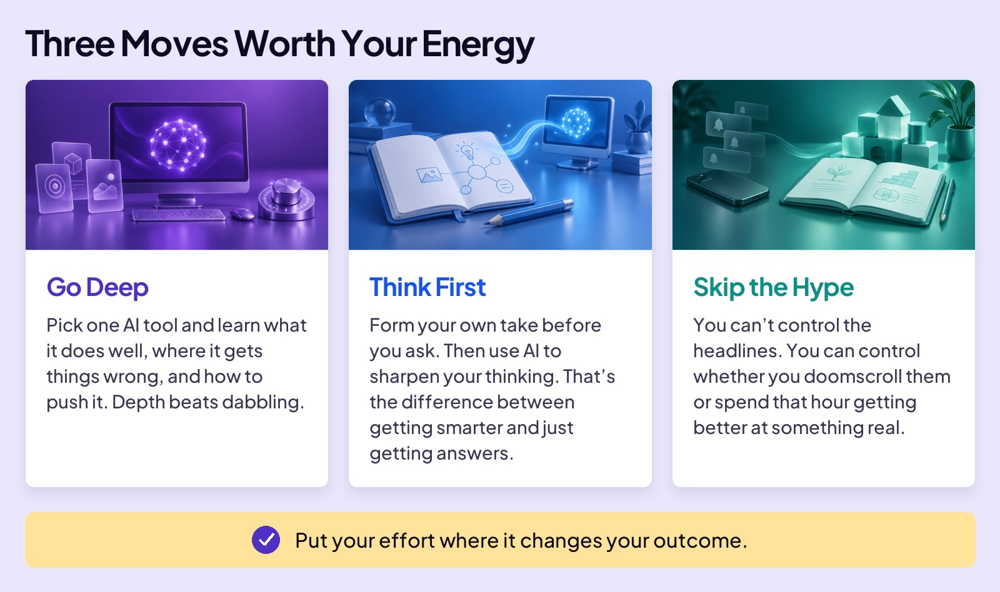
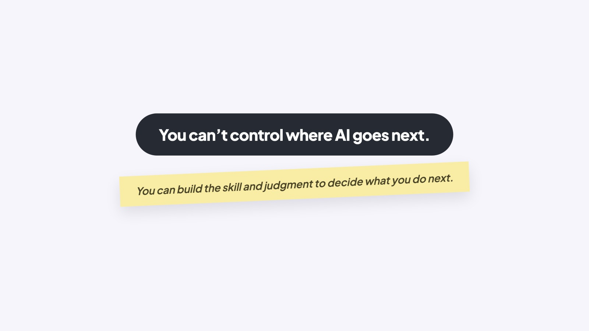

## START SMARTER

# What You Can Control

You’re hearing it constantly: AI is taking jobs. That headline used to be a prediction. Now it’s news.

And jobs are just the loudest headline. AI is also reshaping who holds power, what it costs the planet, and what you can trust online. Which way it all goes, nobody knows yet, including the people making the predictions. And almost none of it is in your hands.

So here’s the question worth asking: what’s in your hands, and what isn’t?

### Board 1: What’s in Your Hands?

**Image file:** `what-you-can-control-1-hands.jpg`

**Teaching content:**

Out of your hands: how AI changes future jobs, how quickly AI changes, how much work AI can produce, how other people use AI, and what the next headline predicts.

In your hands: build real depth in something you care about, stay curious and keep what works, practice coming up with your own ideas, choose how you use AI and how you work with other people, and make something real instead of waiting to see what happens.

You don’t control every outcome. Your choices still matter.

Keep informed about the left column. Put most of your energy into the right.

## SO WHAT DO YOU DO?

That right column isn’t a feeling, it’s a to-do list. Three moves worth your energy.

### Board 2: Three Moves Worth Your Energy

**Image file:** `what-you-can-control-2-three-moves.jpg`

**Teaching content:**

Go deep: pick one AI tool and learn what it does well, where it gets things wrong, and how to push it. Depth beats dabbling.

Think first: form your own take before you ask. Then use AI to sharpen your thinking. That’s the difference between getting smarter and just getting answers.

Skip the hype: you can’t control the headlines. You can control whether you doomscroll them or spend that hour getting better at something real.

Put your effort where it changes your outcome.

### Close

**Image file:** `what-you-can-control-3-close.jpg`

## Closing Message

You can’t control where AI goes next.

You can build the skill and judgment to decide what you do next.
