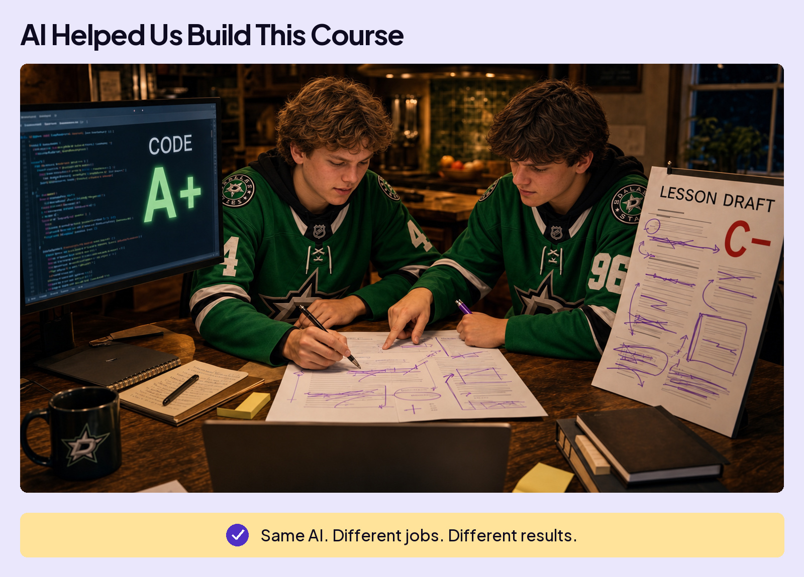
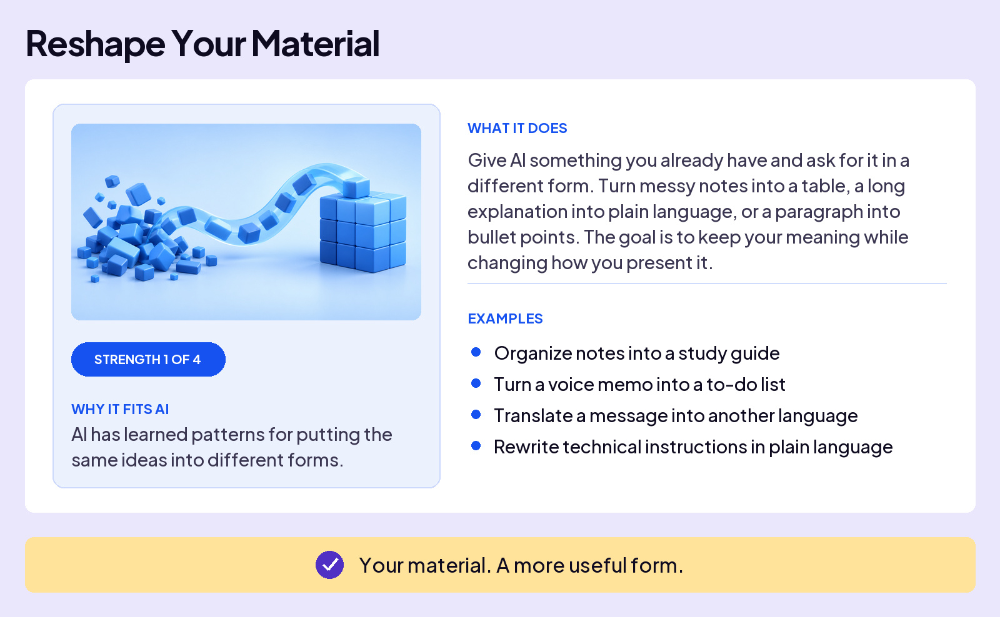
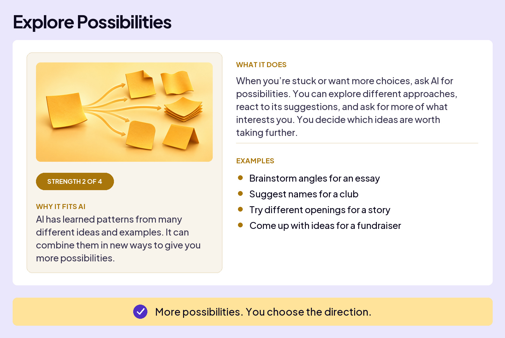
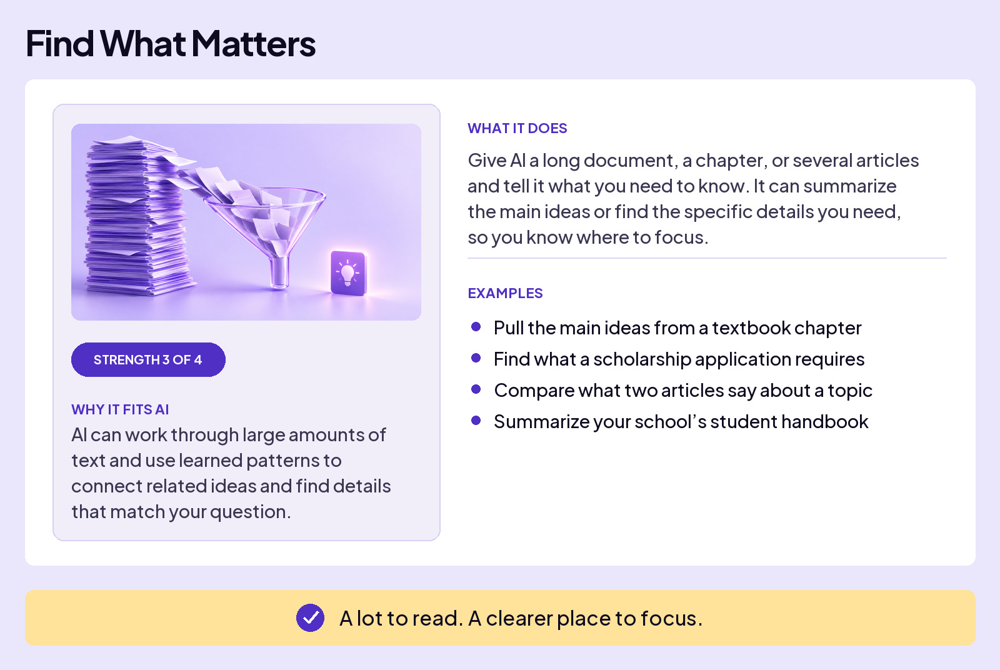
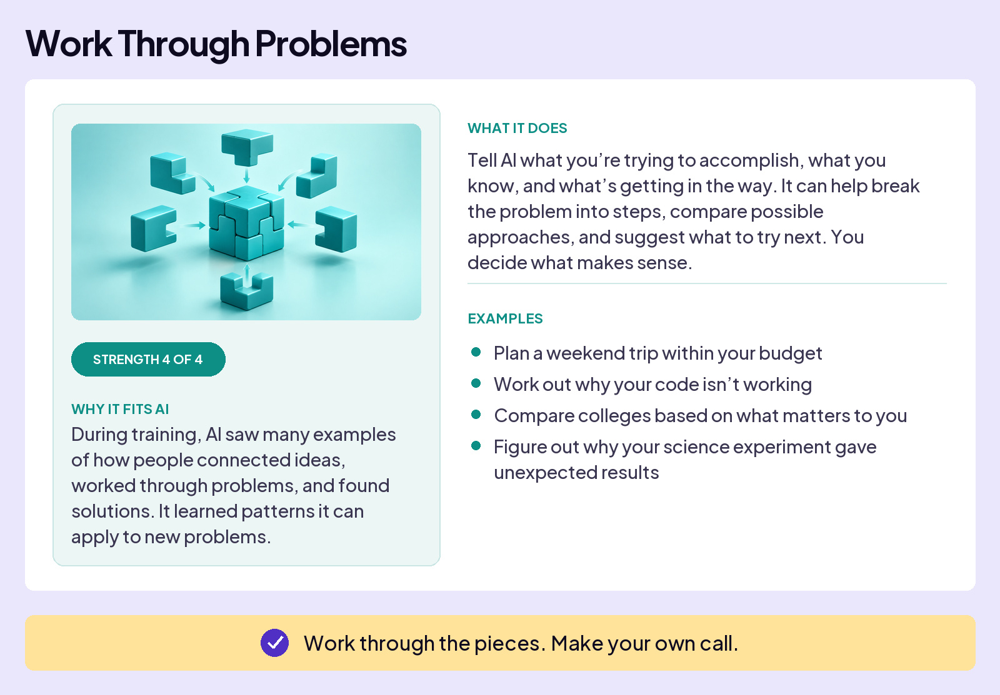
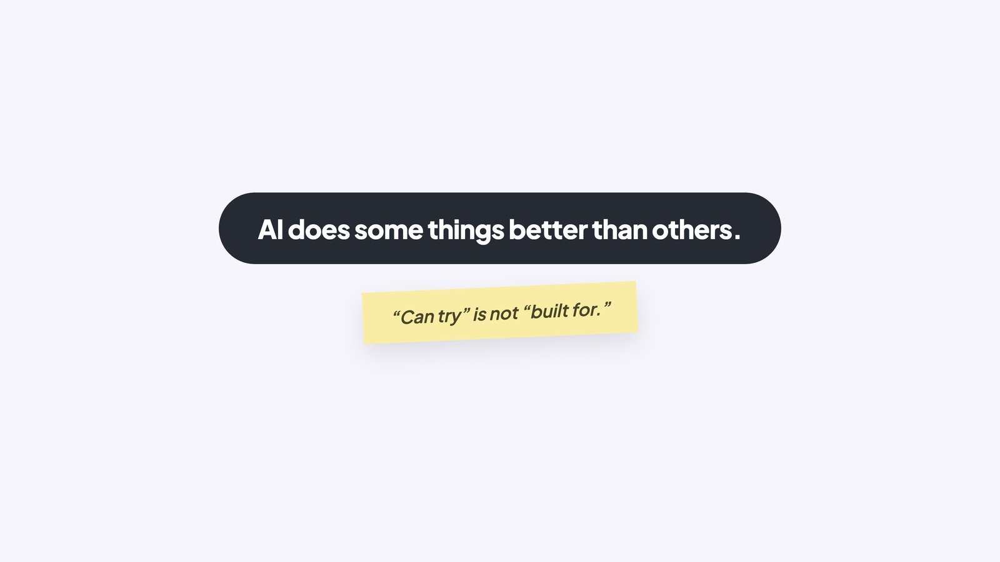

## WORK WITH AI

# Where AI Works Best

AI will take on almost anything you ask: writing, planning, summarizing, coding, drawing, researching, and more. But **can try** is not the same as **built for**, and AI is far better at some kinds of work than others.

We saw this firsthand building this course. AI coded every page and every interaction you’ll see, and we give it a grade of **A+** for coding. It also wrote the first drafts of all lessons, but only earned a **C-**. It made points in the wrong order, added explanations that missed what we meant, and had no real feel for how a lesson should flow.

### Board 1: AI Helped Us Build This Course

**Image file:** `where-ai-works-best-1-built-this-course.jpg`

**Teaching content:**

On one side, the course code, graded A+. On the other, a lesson draft, graded C-, marked up with corrections. Same AI. Different jobs. Different results.

That gap taught us something. AI could test whether a button worked or a page loaded correctly. A lesson needed more: the right ideas, in the right order, explained in a way that made sense to you. AI gave us drafts, but they weren’t good enough to use. We had to decide what worked and what needed to change.

Here are four strengths you can put to work. AI is strongest when the job has one of four shapes.

### Board 2: Reshape Your Material

**Image file:** `where-ai-works-best-2-reshape.jpg`

**Teaching content:**

Strength 1 of 4. Why it fits AI: AI has learned patterns for putting the same ideas into different forms.

What it does: give AI something you already have and ask for it in a different form. Turn messy notes into a table, a long explanation into plain language, or a paragraph into bullet points. The goal is to keep your meaning while changing how you present it.

Examples: organize notes into a study guide. Turn a voice memo into a to-do list. Translate a message into another language. Rewrite technical instructions in plain language.

Your material. A more useful form.

### Board 3: Explore Possibilities

**Image file:** `where-ai-works-best-3-explore.jpg`

**Teaching content:**

Strength 2 of 4. Why it fits AI: AI has learned patterns from many different ideas and examples. It can combine them in new ways to give you more possibilities.

What it does: when you’re stuck or want more choices, ask AI for possibilities. You can explore different approaches, react to its suggestions, and ask for more of what interests you. You decide which ideas are worth taking further.

Examples: brainstorm angles for an essay. Suggest names for a club. Try different openings for a story. Come up with ideas for a fundraiser.

More possibilities. You choose the direction.

### Board 4: Find What Matters

**Image file:** `where-ai-works-best-4-find.jpg`

**Teaching content:**

Strength 3 of 4. Why it fits AI: AI can work through large amounts of text and use learned patterns to connect related ideas and find details that match your question.

What it does: give AI a long document, a chapter, or several articles and tell it what you need to know. It can summarize the main ideas or find the specific details you need, so you know where to focus.

Examples: pull the main ideas from a textbook chapter. Find what a scholarship application requires. Compare what two articles say about a topic. Summarize your school’s student handbook.

A lot to read. A clearer place to focus.

### Board 5: Work Through Problems

**Image file:** `where-ai-works-best-5-problems.jpg`

**Teaching content:**

Strength 4 of 4. Why it fits AI: during training, AI saw many examples of how people connected ideas, worked through problems, and found solutions. It learned patterns it can apply to new problems.

What it does: tell AI what you’re trying to accomplish, what you know, and what’s getting in the way. It can help break the problem into steps, compare possible approaches, and suggest what to try next. You decide what makes sense.

Examples: plan a weekend trip within your budget. Work out why your code isn’t working. Compare colleges based on what matters to you. Figure out why your science experiment gave unexpected results.

Work through the pieces. Make your own call.

## Why this works: vast exposure

Training gave AI exposure to more examples than any human could read in a lifetime: code, essays, explanations, emails, arguments, stories, documents, and conversations. That’s why it’s fluent with common formats. It has seen many versions of “this kind of thing” before.

Seeing many examples helps AI get started. But it doesn’t guarantee the answer is right or that it fits what you need. That’s where your knowledge and judgment matter.

### Close

**Image file:** `where-ai-works-best-6-close.jpg`

## Closing Message

AI does some things better than others.

“Can try” is not “built for.”
