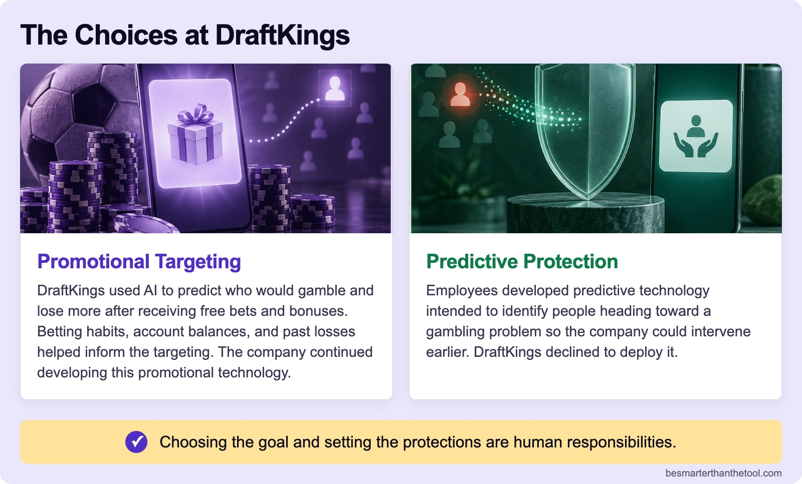
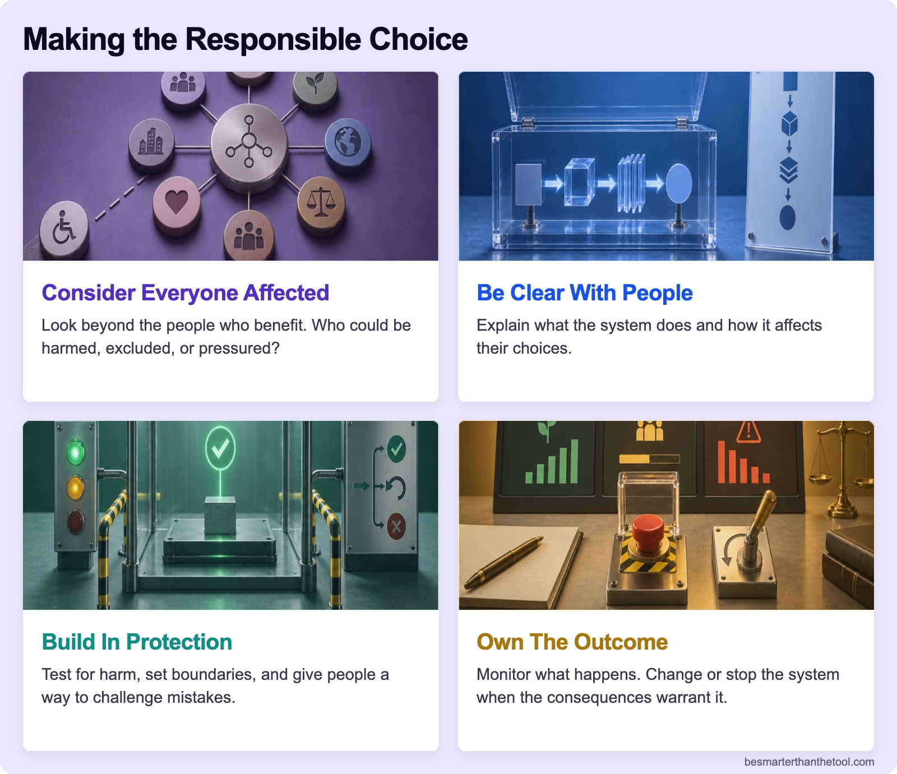

## BUILD YOUR SKILLS

# Where’s the Line?

AI can do remarkable things. But people remain responsible for how it is used and what happens as a result.

That responsibility goes beyond checking an answer or writing a better prompt. It includes deciding what we ask AI to accomplish and considering who could be affected.

That’s **ethics: thinking through what you should do and how your decisions affect other people.**

## CASE STUDY: ONLINE GAMBLING

DraftKings is an online gambling platform where customers play casino games and make sports bets. The company earns money when customers lose.

That creates an ethical tension. Encouraging customers to keep playing can increase revenue. But some people struggle to control their gambling, with serious consequences for their finances and relationships. When should a company stop encouraging someone to play?

## WHY IS THIS IN YOUR AI COURSE?

AI can identify patterns in betting behavior, including how often customers play, how much they bet, and how much they lose. Those patterns can help predict which customers would gamble and lose more after receiving a promotion.

Similar data can also help identify people who may be developing a gambling problem, creating an opportunity to intervene earlier.

What responsibility does a company have when it can use customer data both to encourage more gambling and to recognize possible harm? What protections should it require, even if they reduce revenue?

The New York Times investigated these choices at DraftKings. Here’s what it reported.

### Board 1: The Choices at DraftKings

**Image file:** `wheres-the-line-two-uses.jpg`

**Teaching content:** According to New York Times reporting:

- **Promotional Targeting:** DraftKings used AI to predict who would gamble and lose more after receiving free bets and bonuses. Betting habits, account balances, and past losses helped inform the targeting. The company continued developing this promotional technology.
- **Predictive Protection:** Employees developed predictive technology intended to identify people heading toward a gambling problem so the company could intervene earlier. DraftKings declined to deploy it.

**Takeaway:** Choosing the goal and setting the protections are human responsibilities.

DraftKings disputes targeting customers based on losses. It says it already monitors risky behavior and found insufficient evidence to support the proposed predictive safeguards.

## WHAT ETHICS ASKS

Accuracy, profitability, and usefulness matter, but none of them proves that a use of AI is responsible. Laws and company policies set some boundaries. They do not answer every decision. Even a worthwhile goal requires attention to the consequences.

A system can accomplish its assigned goal while harming people. Choosing the goal and setting the protections are human responsibilities.

Responsibility belongs to the people who choose the goal, build the system, buy it, approve it, and decide how it will be used. You may face those decisions in your career even if you never write an AI model.

People can reasonably disagree about a decision. Strong reasoning still has to consider who is affected, what evidence supports the choice, and what consequences could follow.

## TURN JUDGMENT INTO ACTION

Four moves make responsible judgment concrete:

### Board 2: Making the Responsible Choice

**Image file:** `wheres-the-line-responsible-choice.jpg`

**Teaching content:**

1. **Consider everyone affected.** Look beyond the people who benefit. Who could be harmed, excluded, or pressured?
2. **Be clear with people.** Explain what the system does and how it affects their choices.
3. **Build in protection.** Test for harm, set boundaries, and give people a way to challenge mistakes.
4. **Own the outcome.** Monitor what happens. Change or stop the system when the consequences warrant it.

A responsible decision considers the people who live with it.

Applied to the DraftKings story, a team would need to consider customers who may be vulnerable, explain promotional offers honestly, evaluate whether safeguards reduce harm, and monitor what happens after the system is launched. No single technical fix guarantees a responsible result. The team has to keep watching the consequences and respond to them.

## TRY IT: WOULD YOU APPROVE IT?

The scenarios below are fictional. They are not additional allegations about named companies.

For each scenario, use the four moves to choose:

- Approve
- Approve with changes
- Do not approve

Then answer: **Why? What would you need to know or change?**

If you choose Approve with changes, propose a specific protection, explanation, review process, or boundary. There is no score or predetermined correct answer, but some decisions are better supported than others.

1. **Who Gets an Interview?** An AI ranks applicants using patterns from past successful hires. Applicants from unfamiliar schools rarely reach the shortlist. Your manager proposes automatically rejecting low-ranked applicants.
   - Consider the applicants who may be excluded and ask what evidence shows the ranking predicts future success. A concrete protection could be human review of rejections, regular checks of who gets screened out, and a way for applicants to challenge mistakes.
2. **The Right Offer. For Whom?** A lending model identifies people with rising credit card balances who are likely to accept a loan. Some could replace expensive debt with cheaper borrowing. Others could struggle with another payment. Your manager wants to launch because the predicted acceptance rate is high.
   - Acceptance does not show that the loan helps the customer. Compare its total cost with the debt it may replace, explain the terms clearly, test who benefits or struggles, and make declining easy. Then monitor whether the offer creates financial harm.
3. **Keeping Someone Playing.** A gaming company identifies players likely to make a purchase after losing. Your team proposes sending a limited-time offer immediately after a loss.
   - Consider players who may feel pressured after losing. Ask what evidence shows the offer is helpful, explain it honestly, and propose a boundary such as avoiding loss-triggered offers or limiting their timing. Monitor whether the system increases harmful behavior.
4. **Spotting Trouble Early.** A bank’s AI identifies spending patterns that may indicate financial trouble. Evaluate two actions separately:
   - **Private warning and offer of help.** A warning may help, but a false alert can create stress. Explain why the person received it, test the signal’s accuracy, offer useful choices, and give the customer a way to correct the record. Monitor whether warnings help without creating unnecessary harm.
   - **Automatic credit-limit cut.** A limit cut can remove credit when someone needs it and may make their finances worse. Ask what evidence justifies automatic action, require meaningful notice and human review, provide an appeal, and monitor the consequences for customers.

After each decision, open “Something to consider” and compare its reasoning with yours.

You may not write the algorithm. You might choose the goal, approve the campaign, buy the system, or decide what happens after an alert. Those choices carry responsibility.

### Board 3: Close

**Image file:** `wheres-the-line-close.jpg`

## Closing Message

Choose the goal. Consider the consequences.

What AI helps you accomplish affects other people.

## Source record

The linked source record is maintained at `docs/research/wheres-the-line-sources.md`.
