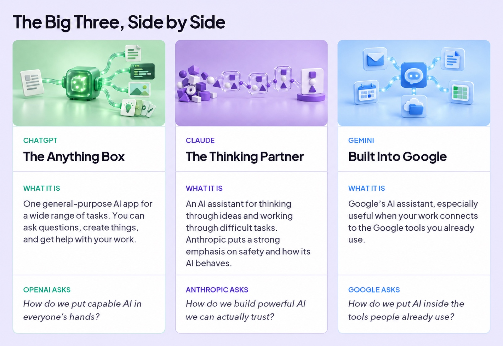
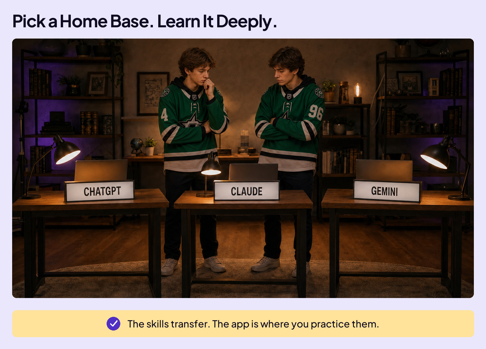
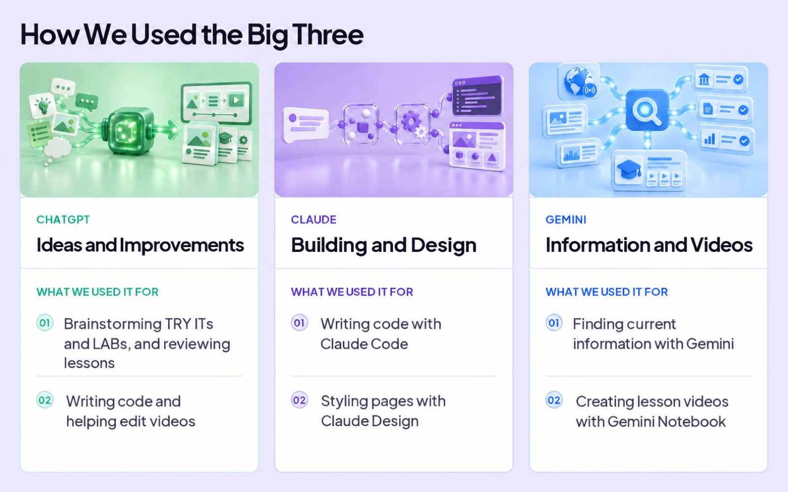
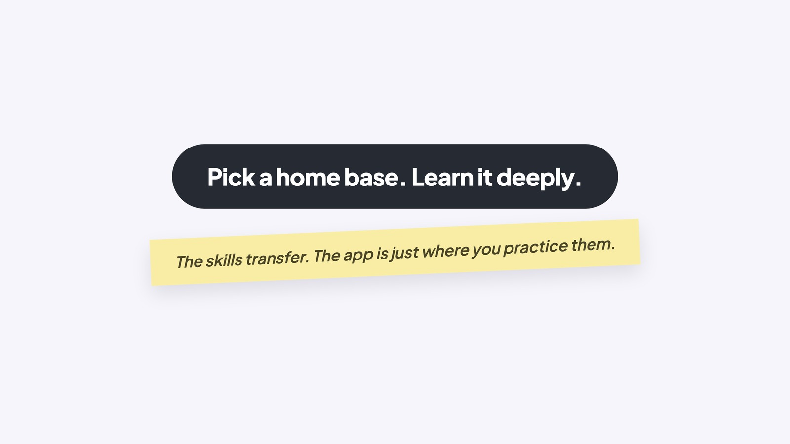

## WORK WITH AI

# Which App?

When you sit down to use AI, your first decision is which app to use. Three you’ll hear about often are ChatGPT from OpenAI, Claude from Anthropic, and Gemini from Google. All three can chat, write, code, and answer questions. So why does it matter which one you pick?

## Different Philosophies

Think about it like this. In-N-Out and McDonald’s both sell cheeseburgers, built from roughly the same ingredients. They’re still completely different experiences, because each company has a different idea of what a burger place should be. One does a tiny menu with everything made fresh. The other is engineered for speed, scale, and being exactly the same in every city on Earth.

The big three AI apps are like that. They all use AI models that learn patterns during training. But each company makes different choices about how to train its models and what to build into its app.

Those choices shape much of how each app differs: how it feels, what it’s good at, and how it acts when it’s not sure. Underneath, each one is built around a different core philosophy.

### Board 1: The Big Three, Side by Side

**Image file:** `which-app-1-big-three.jpg`

**Teaching content:**

ChatGPT, the Anything Box. What it is: one general-purpose AI app for a wide range of tasks. You can ask questions, create things, and get help with your work. OpenAI asks: how do we put capable AI in everyone’s hands?

Claude, the Thinking Partner. What it is: an AI assistant for thinking through ideas and working through difficult tasks. Anthropic puts a strong emphasis on safety and how its AI behaves. Anthropic asks: how do we build powerful AI we can actually trust?

Gemini, Built Into Google. What it is: Google’s AI assistant, especially useful when your work connects to the Google tools you already use. Google asks: how do we put AI inside the tools people already use?

Each app has its own strengths, but there’s plenty of overlap in what they can do.

## WHICH APP SHOULD YOU USE?

Honest answer: for most of what you’ll do, any of the three can do the job if it is available to you. Don’t agonize over the choice. There’s no single best app, and what’s best today might not be best tomorrow.

Claude currently requires users to be 18. We include it here because knowing your options matters, even before you can use them.

For this course, ChatGPT is your hands-on home base. Learn it well: its settings, its features, its quirks. Knowing one app deeply beats dabbling in all three.

### Board 2: Pick a Home Base. Learn It Deeply.

**Image file:** `which-app-2-home-base.jpg`

**Teaching content:**

Three workstations, labeled ChatGPT, Claude, and Gemini. Pick one and learn it deeply. The skills transfer. The app is where you practice them.

A power move for later: ask the same question in a second app. It may catch something the first app missed or suggest a different approach. If they disagree, you have something to investigate. But agreement doesn’t guarantee they’re right.

## A real-world example

Several AI apps helped bring this course to life. Sometimes different apps handled different jobs. Sometimes they helped with the same job. Here are a few examples.

### Board 3: How We Used the Big Three

**Image file:** `which-app-3-how-we-used.jpg`

**Teaching content:**

ChatGPT, ideas and improvements: brainstorming TRY ITs and LABs, and reviewing lessons; writing code and helping edit videos.

Claude, building and design: writing code with Claude Code; styling pages with Claude Design.

Gemini, information and videos: finding current information with Gemini; creating lesson videos with Gemini Notebook.

### Close

**Image file:** `which-app-4-close.jpg`

## Closing Message

Pick a home base. Learn it deeply.

The skills transfer. The app is just where you practice them.
