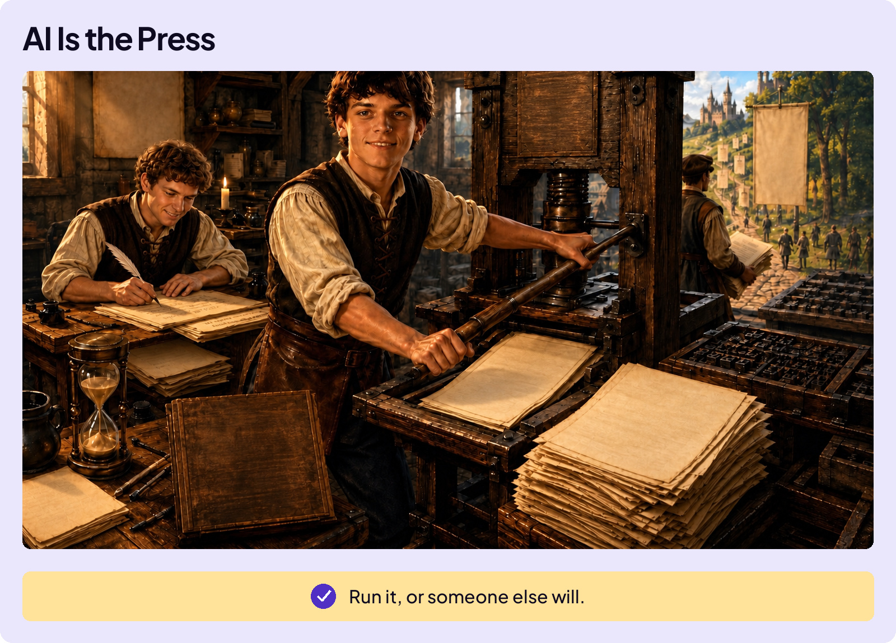
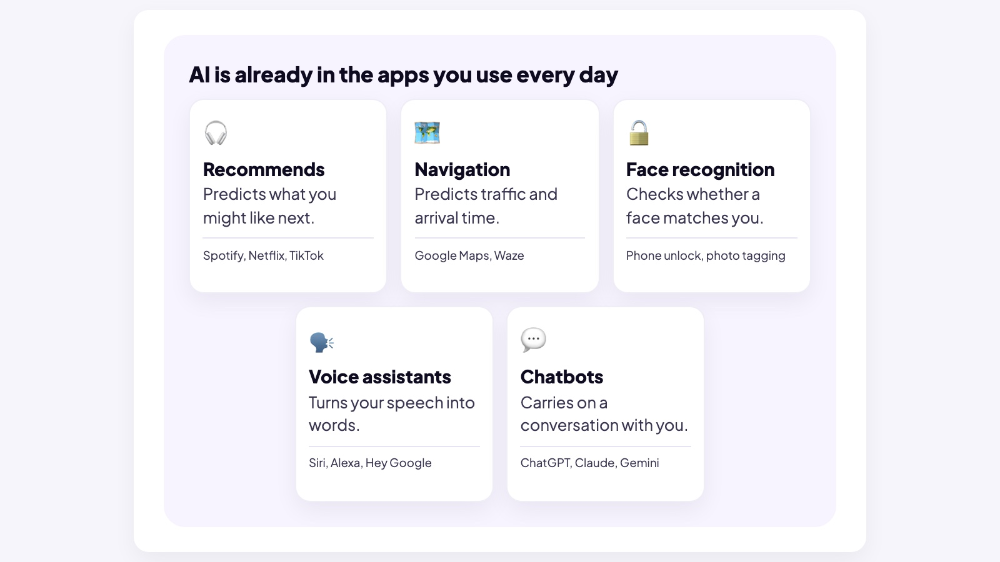
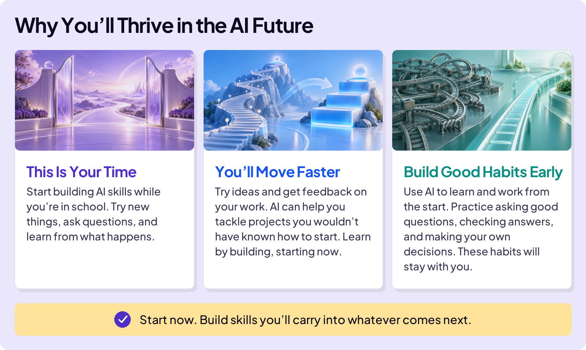
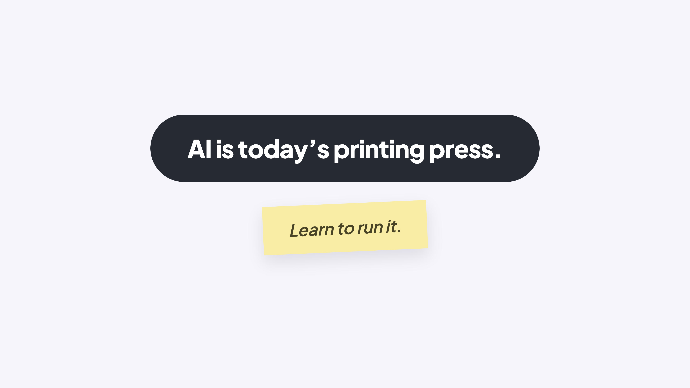

## START SMARTER

# Why Learn AI?

Pretend you’re a scribe in the 1450s. All day, you hand-copy the king’s proclamations and send them out across the kingdom. Good work. Steady job. Then one morning, you hear that a guy in Mainz built a machine that prints pages a thousand times faster than you can write them. Two choices: pretend it isn’t happening, or learn the new machine well enough to run it.

### Board 1: AI Is the Press

**Image file:** `why-learn-ai-1-press.jpg`

**Teaching content:**

A young printer runs an early printing press in a 1450s workshop while another worker still copies a page by hand. Stacks of printed pages show how the machine multiplies the work. Run it, or someone else will.

## AI IS EVERYWHERE

AI isn’t something you go visit. It’s already in the apps on your phone, the search results you read, and the tools your first job will hand you on day one. It feels like AI went from sci-fi to normal in a few years. Most of what it does today, it will do better tomorrow.

### Board 2: Where AI Already Lives

**Image file:** `why-learn-ai-1-everyday.jpg`

**Teaching content:**

AI already lives in five places you use. Recommendations predict what you might like next; you have seen it in Spotify, Netflix, and TikTok. Navigation predicts traffic and arrival time; you have seen it in Google Maps and Waze. Face recognition checks whether a face matches you; you have seen it in phone unlock and photo tagging. Voice assistants turn your speech into words; you have seen it in Siri, Alexa, and Hey Google. Chatbots carry on a conversation with you; you have seen it in ChatGPT, Claude, and Gemini.

AI was already part of your day before chatbots arrived.

## YOU CAN START NOW

Here’s the great news: you don’t have to wait until college or your first job to get good at this. You can start now. Learn what AI does well, notice where it struggles, and practice using it for something you care about. Every project gives you experience you can bring to the next one.

Before personal computers, becoming a designer meant years at a drafting table learning design by hand. Then desktop publishing put powerful design tools on a teenager’s desk. They could create posters, magazines, and brochures while developing their skills. The tool didn’t replace skill. It shortened the distance between wanting to do the work and actually doing it.

### Board 3: Why You’ll Thrive in the AI Future

**Image file:** `why-learn-ai-2-thrive.jpg`

**Teaching content:**

Three reasons you will thrive.

This is your time: start building AI skills while you’re in school. Try new things, ask questions, and learn from what happens.

You’ll move faster: try ideas and get feedback on your work. AI can help you tackle projects you wouldn’t have known how to start. Learn by building, starting now.

Build good habits early: use AI to learn and work from the start. Practice asking good questions, checking answers, and making your own decisions. These habits will stay with you.

Start now. Build skills you’ll carry into whatever comes next.

## THIS HAS HAPPENED BEFORE

AI isn’t the first technology to transform how people work. The steam engine did it for physical labor, electricity for factories, and the internet for information. AI could do it across almost everything.

In July 2025, the White House released an official national strategy document, Winning the Race: America’s AI Action Plan. Here’s how it describes what AI makes possible: “An industrial revolution, an information revolution, and a renaissance, all at once. This is the potential that AI presents.”

### Close

**Image file:** `why-learn-ai-3-close.jpg`

## Closing Message

AI is today’s printing press.

Learn to run it.
