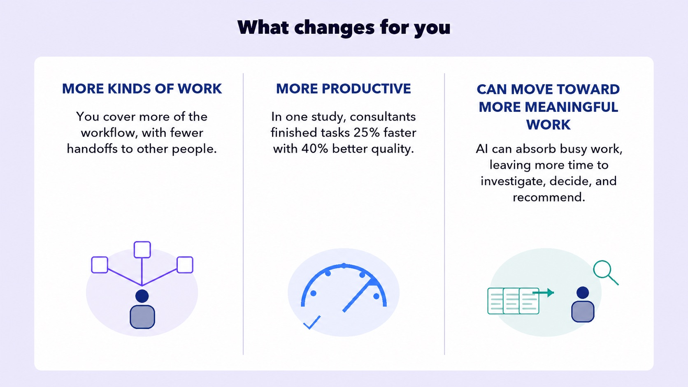

## EMBRACE THE FUTURE

# Work Changes

You already know that AI is changing the world. Don’t worry, you’ll **Be Smarter Than the Tool**.

Before you know it, you’ll be finished with school and starting your career. How is AI changing work? Glad you asked.

## THE BIG IDEA

# Your job title may stay the same. The work underneath it won’t.

Most students will not grow up to have an “AI job.” They’ll become nurses, engineers, marketers, electricians, teachers, lawyers, designers, and thousands of other things. AI will sit inside those jobs and change how the work gets done.

The useful question is not only which jobs AI might replace. It is what your working day looks like when everyone has it.

## YOU ALREADY KNOW THE PIECES

Earlier, you learned where AI works best. It transforms material, generates options, compresses information, and reasons through what you give it. You also learned why school still matters: everyone can use a similar tool, but what you know shapes what you ask and what you do with the answer.

- Transform
- Generate
- Compress
- Reason

Now put those two lessons inside a workplace.

## YOUR FIRST ASSIGNMENT

# “Read these 500 customer comments. Tell us what is going wrong and what we should fix.”

A new employee could receive the same assignment before AI and with AI. What changes is where the real work begins.

## Before AI

Most of the time goes into making the first pass.

1. Read and organize every comment
2. Find recurring themes
3. Build a spreadsheet
4. Draft the presentation
5. Present the findings

## With AI

AI makes the first pass. The employee takes it further.

1. AI groups the comments and proposes themes
2. The employee checks the source comments
3. They find the customers the summary overlooked
4. They investigate why the problem is happening
5. They recommend what the company should do

The employee did not simply finish the old assignment faster. The assignment became bigger. Making the summary used to be most of the job. Now it is where the job begins.

## TWO WAYS THE WORK CHANGES

Most jobs will contain both. Some steps disappear into the tool. Other steps become faster, broader, or more ambitious. Either way, the outcome still needs an owner.

## WHAT CHANGES FOR YOU

Put automation and augmentation together, and three changes show up across many careers.

If research and a first draft once took two days, an employer probably will not turn the saved time into two days off. The worker may be asked to investigate more possibilities, handle an adjacent part of the project, or finish the whole assignment sooner.

## THE FIRST RUNG GETS SHORTER

Here is the part that matters especially for you. The work AI handles first is often the work beginners used to do to learn a profession: basic research, first drafts, starter code, simple analysis, and routine documentation.

# AI can make you productive before it makes you knowledgeable.

That creates a strange problem. A new employee may be expected to check sophisticated work after getting fewer chances to practice producing it from scratch.

This is why Does School Matter? mattered. You still need the knowledge and the reps. The difference is that you may have to build them more deliberately.

Your first job will not just ask whether you can use AI. It will ask whether you can take everything AI produces and turn it into a result.

**The first pass becomes the starting line.**

Your job is what happens next.

AI is changing the work you’ll do.

Now it’s on you to LEARN.

## TRY IT — Your First Week with AI

AI has already produced the first pass. In each situation, decide what the new employee needs to do next.

### 1. Customer research

AI sorts 500 customer comments, identifies three themes, and builds a polished presentation in ten minutes. What should the new employee do next?

- Send the presentation
- Ask AI to make it longer
- Check the source comments, investigate what was missed, and make a recommendation

### 2. Software internship

AI writes a fix for a bug, and every automated test passes. The intern cannot explain what the code does. What is the best next move?

- Ship it because the tests passed
- Work through the code, understand it, and then test the edge cases
- Ask AI if its code is correct

### 3. Marketing team

AI produces three campaign concepts, sample ads, and audience research before lunch. The manager asks the new hire to choose a direction for the launch. What changed?

- The job is now making more drafts
- AI owns the campaign
- The first pass became the starting line
