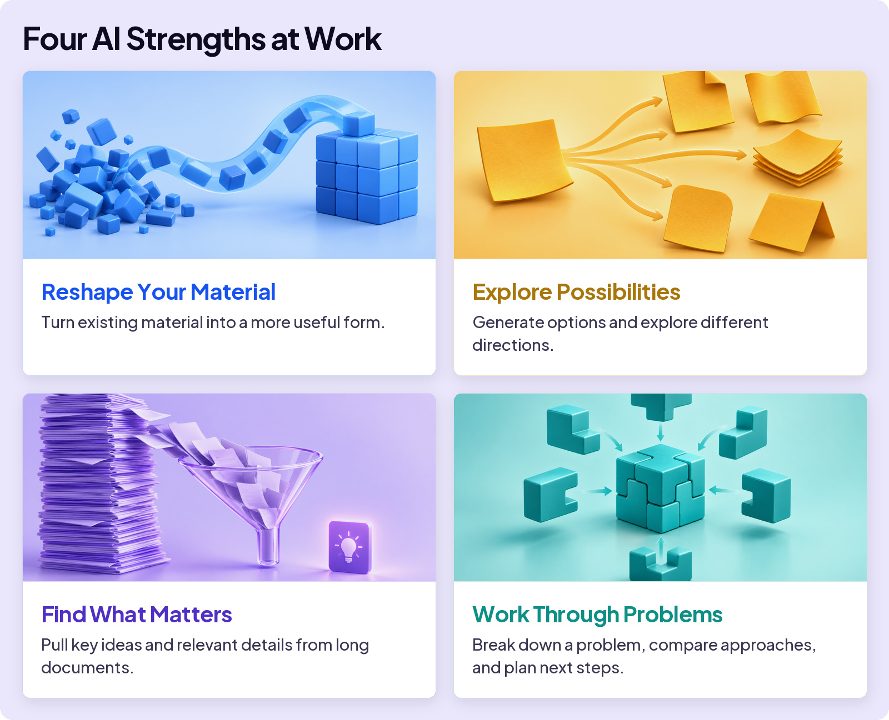
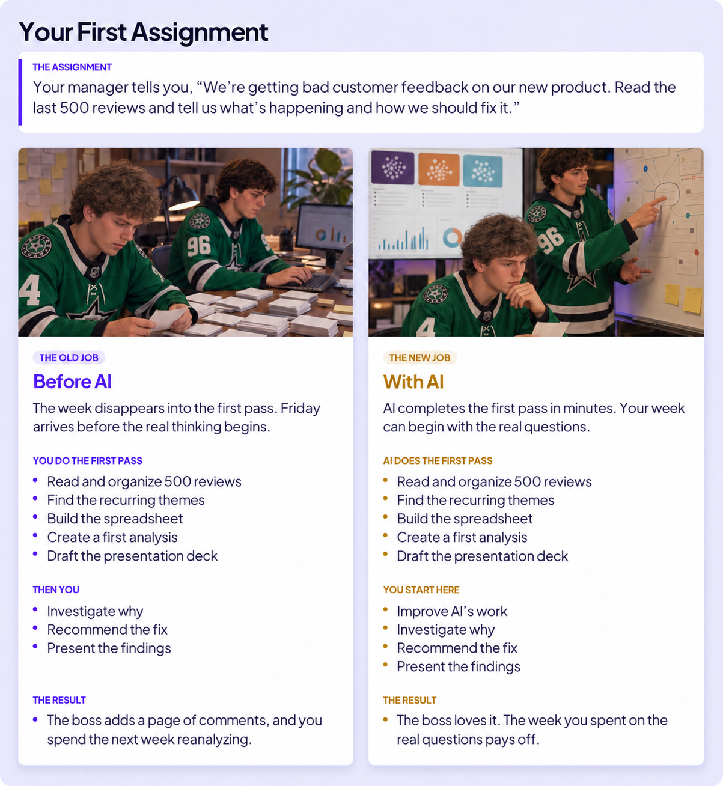
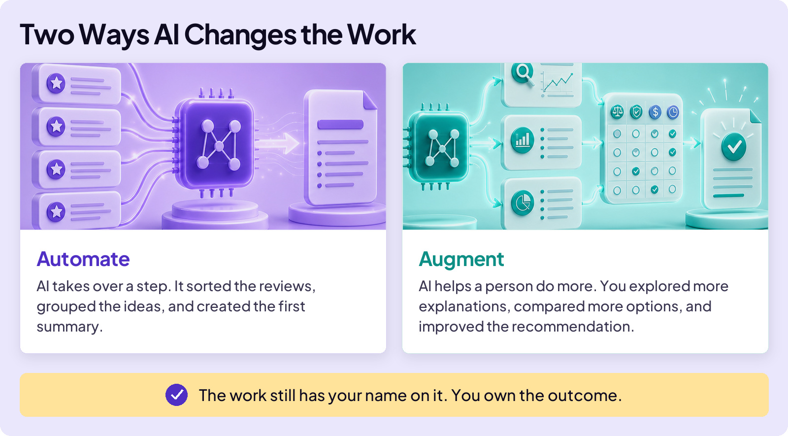
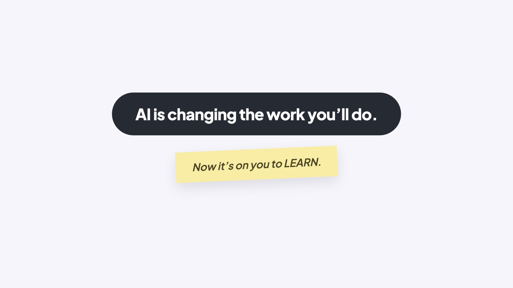

## EMBRACE THE FUTURE

# Work Changes

Before you know it, you’ll be finished with school and starting your career. How is AI changing work? Glad you asked.

Some familiar job titles may still be around: entrepreneur, teacher, lawyer, or designer. But what those jobs look like is already changing, including what people do each day.

## YOU ALREADY KNOW THE PIECES

To understand this, let’s review two concepts you already learned. First: AI is best at specific things, and that’s where you’ll use it in your job.

### Board 1: Four Shapes of AI Work

**Image file:** `work-changes-1-strengths.jpg`

**Teaching content:**

AI is strongest when the job has one of four shapes. Transform: it turns your input into something clearer, cleaner, and better structured. Generate: it creates several options at once. Compress: it turns long documents into what they actually mean. Reason: it works through your input toward an answer.

Second: the importance of learning. If everyone gets similar answers from AI, what sets you apart? It’s what you already know.

## YOUR FIRST ASSIGNMENT

Here’s the same job before AI and with AI. AI can give you more time for the interesting stuff.

### Board 2: Your First Assignment

**Image file:** `work-changes-2-assignment.jpg`

**Teaching content:**

The assignment. Your manager tells you: “We’re getting bad customer feedback on our new product. Read the last 500 reviews and tell us what’s happening and how we should fix it.”

Before AI, the old job. The week disappears into the first pass. Friday arrives before the real thinking begins. You do the first pass: read and organize 500 reviews, find the recurring themes, build the spreadsheet, create a first analysis, draft the presentation deck. Then you investigate why, recommend the fix, and present the findings. The result: the boss adds a page of comments, and you spend the next week reanalyzing.

With AI, the new job. AI completes the first pass in minutes. Your week can begin with the real questions. AI does the first pass: reads and organizes the 500 reviews, finds the recurring themes, builds the spreadsheet, creates a first analysis, drafts the presentation deck. You start here: improve AI’s work, investigate why, recommend the fix, present the findings. The result: the boss loves it. The week you spent on the real questions pays off.

Do you see the point? The busy work was AI’s strengths in action: compressing 500 reviews, transforming them into a spreadsheet and a deck. And improving AI’s work along the way? That took what you already know. AI doesn’t just help you work faster. It can help you focus on what’s really important.

## THE CONCEPTS

There are two terms you’ll hear that describe how AI is changing the nature of work.

### Board 3: Two Ways AI Changes the Work

**Image file:** `work-changes-3-automate-augment.jpg`

**Teaching content:**

Automate: AI takes over a step. In the assignment, it sorted the reviews, grouped the ideas, and created the first summary.

Augment: AI helps a person do more. You explored more explanations, compared more options, and improved the recommendation.

The work still has your name on it. You own the outcome.

Whatever career you choose, AI will do some tasks for you and help you do others. But here’s the important point: the work still has your name on it. You own the outcome.

## WHAT CHANGES WITH AI

Put automation and augmentation together, and three changes show up across almost every career.

### Board 4: What Changes with AI

**Image file:** `work-changes-4-what-changes.jpg`

**Teaching content:**

More kinds of work: you cover more of the workflow, with fewer handoffs to other people.

More productive: in one study, consultants finished certain tasks 25 percent faster with 40 percent higher quality.

Meaningful work: AI can absorb busy work, leaving more time to investigate, decide, and recommend.

## THE PART THAT MATTERS

AI is already changing some entry-level work. Basic research, starter code, and simple analysis often helped new graduates learn a profession. AI can now handle or assist with some of that work.

AI can make you productive before it makes you knowledgeable. That creates a strange problem. You might be asked to check sophisticated work before you’ve had the chance to learn it.

You already know what you must do. Learn. And learn more. And you’re in the best place in the world to do it: school.

### Close

**Image file:** `work-changes-5-close.jpg`

## Closing Message

AI is changing the work you’ll do.

Now it’s on you to LEARN.
