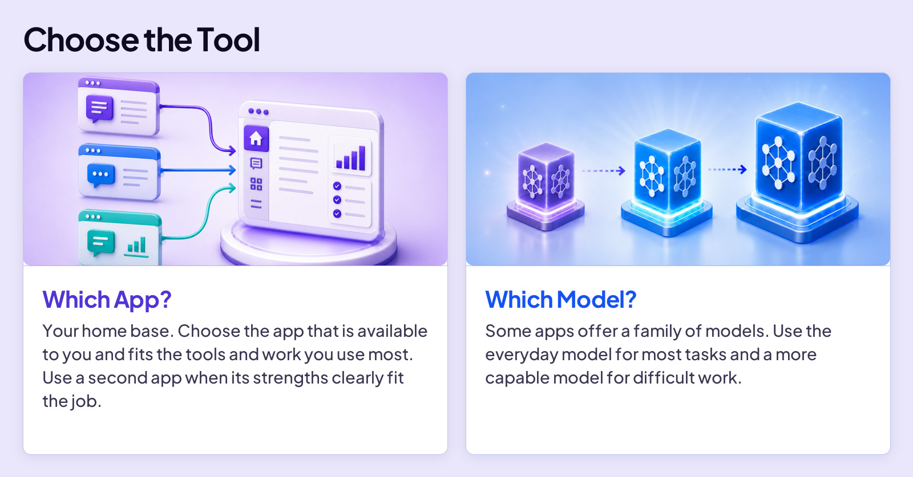
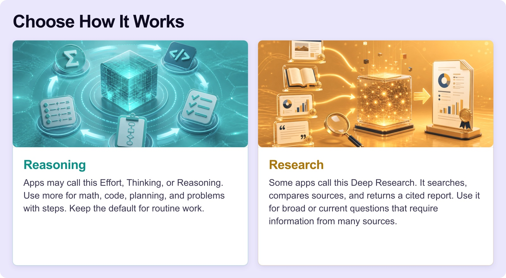
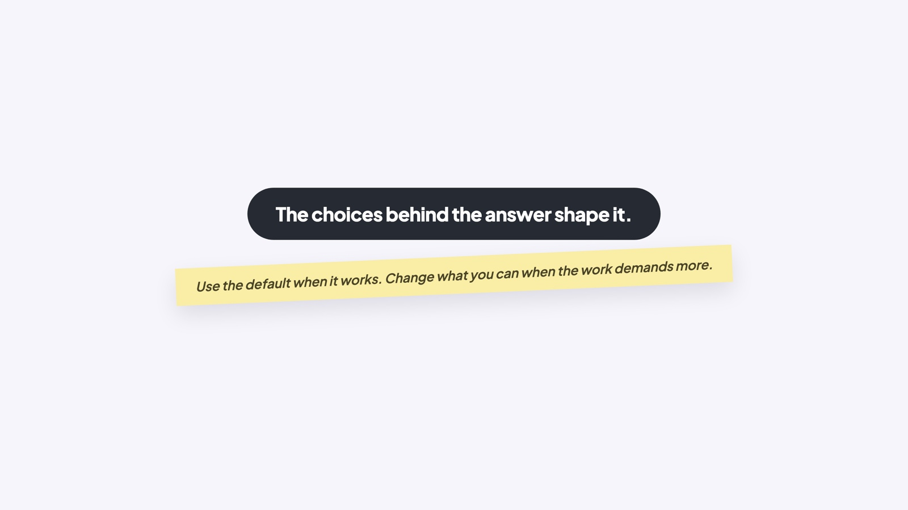

## BUILD YOUR SKILLS

# Your Choices

Choosing a music app is simple. You pick Spotify, Apple Music, or something else, then start listening.

Using AI starts the same way: you pick an app such as ChatGPT or Gemini. But depending on the app and your subscription, you may also be able to choose the model, how much reasoning it uses, and whether it performs deeper research.

You won’t make all four choices every time. The default is a good starting point for most jobs. But when the work is harder or more important, knowing the choices lets you change the right thing.

## AGE RULES MATTER

If you’re under 18, check an app’s age requirements before using it. As of August 2026, ChatGPT requires parental permission for users ages 13–17, Gemini permits many teen accounts but limits some features, and Claude requires users to be 18.

## YOUR CHOICES

Your first choice is the app. The other three choices may or may not appear, depending on the app and your subscription. You do not need to see every choice. You need to understand what each one does when it appears.

### Board 1: Choose the Tool

**Image file:** `your-choices-1-choose-tool.jpg`

**Teaching content:**

Choice 1 is which app. Your home base. Choose the app that is available to you and fits the tools and work you use most. Use a second app when its strengths clearly fit the job.

Choice 2 is which model. Some apps offer a family of models. Use the everyday model for most tasks and a more capable model for difficult work.

### Board 2: Choose How It Works

**Image file:** `your-choices-2-choose-how.jpg`

**Teaching content:**

Choice 3 is reasoning. Apps may call this Effort, Thinking, or Reasoning. Use more for math, code, planning, and problems with steps. Keep the default for routine work.

Choice 4 is research. Some apps call this Deep Research. It searches, compares sources, and returns a cited report. Use it for broad or current questions that require information from many sources.

So the four choices are the app, the model, how much reasoning, and whether to run research. Use the default when it works. Change what you can when the work demands more.

### Board 3: Close

**Image file:** `your-choices-4-close.jpg`

## Closing Message

The choices behind the answer shape it.

Use the default when it works. Change what you can when the work demands more.
